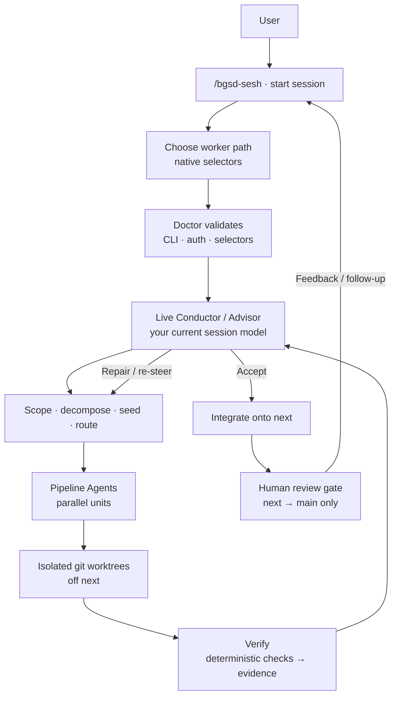

<div align="center">


</div>

# better-gsd

BGSD is a verified, worktree-based GSD conductor. You start one session with the
model you want to reason with — that live session is the **Conductor and
Advisor**. Every new session asks which worker path to use, Doctor validates it,
then Pipeline Agents build in isolated git worktrees. Fresh verification gathers
evidence; the Conductor adjudicates; accepted work lands on `next`. BGSD never
writes directly to your production branch.

## Architecture

One `/bgsd-sesh` (or `conductor.mjs`) run looks like this — more concrete than
the banner, without baking in today's model names:



### What each step does

| Step | Who | What happens |
| --- | --- | --- |
| Start | You | `/bgsd-sesh`, a host skill, or `conductor.mjs` |
| Choose path | You + Conductor | Native selectors pick the worker/executor path for this session |
| Doctor | Engine | Fails closed if CLI, login, or selectors are missing |
| Conduct | Live session | Scopes the prompt, plans units, writes seeds — never swapped by BGSD |
| Build | Pipeline Agents | Each unit works in its own worktree off `next` |
| Verify | Fresh agents | Tests / typecheck / lint / build first; semantic evidence when needed |
| Adjudicate | Conductor | Accept, repair, escalate, or block — no silent green |
| Integrate | Engine | Merges verified units onto `next` |
| Human gate | You | Only you merge `next` → `main` |
| Follow-up | You | `/bgsd-feedback` or another sesh re-enters the same loop |

**Workers are chosen per session, not hardcoded here.** Defaults and presets live
in the docs under **Models & routing** (`bgsd/site` → `/models/`) and the
session selectors. Fast variants and Auto are never silently selected.

Verification is **deterministic-first**. PASS/FAIL evidence informs the
Conductor; it is never an automatic ship decision.

## Install

```sh
# Claude Code
claude plugin marketplace add filippo-fonseca/better-gsd
claude plugin install bgsd@better-gsd

# Codex (from this repo)
codex plugin marketplace add .
codex plugin add bgsd@better-gsd
```

Open GSD for Feature / Project workers:

```sh
npx -y @opengsd/gsd-core@latest --cursor --global   # Cursor workers
npx -y @opengsd/gsd-core@latest --claude --global   # Claude lanes
npx -y @opengsd/gsd-core@latest --codex --global    # Codex lanes
```

Child processes scrub `OPENAI_API_KEY`, `ANTHROPIC_API_KEY`, `CLAUDE_API_KEY`,
and `CURSOR_API_KEY`. Auth is subscription / browser-login only.

## Start a session

```
/bgsd-sesh "Build an audit log"
```

Every **new** session asks for a worker-path preset (and optional custom mix)
via native selectors, then Doctor validates. Resume rehydrates from `run.json`
and skips that setup.

```sh
# Same flow from any terminal
node bgsd/scripts/conductor.mjs "Build an audit log"
node bgsd/scripts/session.mjs --prompt "Build an audit log"
```

## Workflow depth

| Mode | Use it for | Pipeline | Verification |
| --- | --- | --- | --- |
| Quick | one contained correction | Conductor-planned direct workers; no GSD | deterministic checks + Conductor review |
| Feature | a scoped product change | a few worktrees; Loop 2 when needed | per-unit plus integration when applicable |
| Project | multi-surface work | discuss, DAG, waves, full GSD units | Loop 1, Loop 2, evidence to Conductor, human gate |

Work lands on `next`; the merge from `next` to `main` remains human-only.

## Follow-up roadmap

- [#8](https://github.com/filippo-fonseca/better-gsd/issues/8): subscription-safe remote status/control endpoint for Hyperpolymath.
- [#9](https://github.com/filippo-fonseca/better-gsd/issues/9): remote pipeline inspection and control surface.
- [#10](https://github.com/filippo-fonseca/better-gsd/issues/10): desktop/text-editor experience inspired by T3 Code.

## Docs site

```sh
cd bgsd/site && npm i && npm run dev
```

Then open [http://localhost:4321](http://localhost:4321).

Source MDX also lives in [bgsd/docs](./bgsd/docs); the Starlight site builds from [bgsd/site](./bgsd/site).
