<div align="center">



# better-gsd (bgsd)

### Talk to the Conductor. They will handle everything. Seriously.

**bgsd** is an autonomous, self-verifying orchestration layer on top of [GSD](https://github.com/open-gsd/gsd-core), shipped as a single Claude Code plugin. Lightweight to install (markdown files and a handful of zero-dependency Node scripts), but ultra-potent in what it does: describe what you want in one prompt and the Conductor sizes the job, fans out parallel git-worktree agents that `each run a tailored GSD flow` (research / UI scoping extent is all managed at the Conductor's discretion, so tokens are not wasted), verifies every change for real on the browser through a built-in `Playwright MCP` connection loop, assembles the work on a safe staging branch, and hands you a reviewable result. No agent ever writes directly to your production branch.

[](./LICENSE)
[](https://docs.anthropic.com/en/docs/claude-code)
[](./bgsd/.claude-plugin/plugin.json)
[](#architecture-at-a-glance)
[](./CONTRIBUTING.md)

[Landing page](https://site-filippo-fonsecas-projects.vercel.app) · [Docs](./bgsd/docs) · [Changelog](./CHANGELOG.md) · [Contributing](./CONTRIBUTING.md) · [Architecture](./ARCHITECTURE.md)

</div>

---

## Table of contents

- [What is bgsd](#what-is-bgsd)
- [Install](#install)
- [First run](#first-run)
- [Everyday use](#everyday-use)
- [How it works](#how-it-works)
- [Features](#features)
- [Architecture at a glance](#architecture-at-a-glance)
- [Docs](#docs)
- [Contributing](#contributing)
- [License](#license)

---

## What is bgsd

You talk to one entity: the Conductor (default name **Kiwi**, customizable in `BGSD.md`). You never juggle stage commands or babysit agents. You say what you need in plain English, and the Conductor runs the whole build for you: sizing, planning, parallel execution, real verification, integration, and a review gate.

bgsd is **gsd-agnostic**: it does not vendor or bundle GSD. It uses the `gsd-core` plugin installed in your Claude Code and keeps it current for you, so you always ride the latest GSD without ever syncing this repo. The Conductor also provisions the Playwright browser tooling it needs at the start of every session.

The one hard invariant, enforced in code and not just documented: **agents never write to your production branch.** All integration lands on a standing `next` branch, and the `next` to `main` merge is a manual, human-only step.

---

## Install

You need Claude Code first. Then, in any terminal:

```sh
claude plugin marketplace add filippo-fonseca/better-gsd
claude plugin install bgsd@better-gsd
```

Run `/reload-plugins` inside Claude Code (or restart) so the `/bgsd-*` commands appear. The plugin is global across every repo; you never reinstall per project.

There is also a thin npm launcher that runs the same steps for you:

```sh
npx better-gsd@latest
```

bgsd does not contain GSD. The first time you run a session, the Conductor checks for the `gsd-core` plugin (`@opengsd/gsd-core`, installed via `npx`), installs it if missing, keeps it updated, and provisions Playwright MCP for verification.

---

## First run

Open your project (it must be a git repo) and run:

```
/bgsd-init
```

This sets the repo up once. It is idempotent (safe to run repeatedly) and also runs automatically as a preflight on every `/bgsd-sesh`, so you rarely call it by hand. It:

- creates a long-lived **`next`** branch (a safe staging copy of your base branch where work is assembled);
- scaffolds a committed **`.bgsd/`** folder that records every session (`seshs/`, an append-only `ledger.md`, and `config.json`);
- writes a **`BGSD.md`** settings file at the repo root (user-editable knobs, like a CLAUDE.md for bgsd);
- records a managed block in your **`CLAUDE.md`** so any Claude knows this is a bgsd repo.

It never touches your production branch.

---

## Everyday use

One front door, always the same:

```
/bgsd-sesh "what you want, in plain English"
```

That is the whole loop: open repo, run `/bgsd-sesh "..."`, review, ship. Repeat forever.

**Flags** (all optional):

| Flag | What it does |
|------|--------------|
| *(none)* | Conductor auto-detects scale and executes immediately. |
| *(no prompt)* | `/bgsd-sesh` with no prompt: the Conductor proposes the next item from your backlog. |
| `--quick` | Force small scale. No discussion, fast, still fully verified (Loop 1 is never skipped). |
| `--feature` | Force feature scale. A few units, some parallelism, integration loop if more than one unit. |
| `--project` | Force full pipeline. The Conductor discusses with you first (brainstorm, clarify, plan), then executes. |
| `--mode fast\|thorough\|adaptive` | Pipeline-agent depth. `fast` skips research, `thorough` researches every unit, `adaptive` (default) lets the Conductor decide per unit. |
| `--verify-mode fast\|thorough\|adaptive` | Verifier depth, same three levels; `adaptive` is the default. |
| `--no-usage-verification` | Code-only verify. Runs the goal-backward verifier but skips Playwright UI testing (good for non-UI changes). |
| `--headless-ui` | Run Playwright headless: no visible browser or server window pops up (discreet). |
| `--gui` | Open the live web dashboard of all agents by lane and GSD substage. |
| `--fable` | Turn on a standalone **Fable pre-plan** for **every** unit (it is off by default; without this flag, units run the normal GSD workflow on Opus unless the Conductor opts one in). This adds an upstream planner that writes `.planning/fable-plan.md` and seeds the Opus pipeline agent; it never puts Fable on the build. The executor stays Opus. Override the model for any unit conversationally, anytime, by just telling the Conductor. |
| `--sonnet` | Allow the executor to drop to **Sonnet · xhigh** on trivial units (difficulty **<0.2**) only. Without this flag the executor is always Opus. |
| `--plan-only` / `--dry-run` | Preview only. Classify and print the plan; nothing runs. |

A manual flag always wins: **flag > `BGSD.md` > default**. Scale flags bypass the auto-scale thresholds unconditionally.

### Using the Fable pre-planner

By default every unit runs the normal GSD workflow on **Opus**, with **no Fable pre-plan** (difficulty does not trigger one). Fable is brought in only when you ask for it, and only as a plan-only pre-pass that seeds the Opus pipeline agent. Three ways to turn it on:

1. **Per session:** pass `--fable` to give every unit a Fable pre-plan.
   ```
   /bgsd-sesh "fix the checkout flow" --fable
   ```
2. **Conversationally:** just tell the Conductor, for the whole run or one unit: "run a Fable pre-plan on the payments unit first." It opts that unit in with no restart.
3. **Repo default:** persist `models.fable: on` in `BGSD.md` (or tell the Conductor to save it) so every session gets it.

There is a fourth path: if the **Conductor itself is running on Fable** with [Fable-as-Advisor mode](#how-bgsd-picks-models) active, Kiwi authors each unit's seed plan directly (to `.bgsd/runs/<run-id>/seeds/<unit-id>.md`) and the standalone pre-planner subprocess is skipped — the Fable reasoning was already spent in-session.

When it runs, the Conductor launches the pre-planner as a Bash subprocess (`claude -p /bgsd-plan-unit --model claude-fable-5 … --out .planning/fable-plan.md`), then passes `--seed-plan` to the Opus pipeline agent. The executor stays Opus; Fable only plans. Two things must hold for it to actually reach Fable: the session must be on a bgsd build that has this wiring (run `/reload-plugins` after updating), and `claude -p --model claude-fable-5` must resolve to Fable in your environment (test with `claude -p "hi" --model claude-fable-5`). It is never spawned through the in-session Agent tool, which cannot select Fable.

You mostly just use `/bgsd-sesh`, but a few other commands are useful directly: **`/bgsd-resume`** (pick up an interrupted session), **`/bgsd-gui`** (open the live dashboard), **`/bgsd-modify-memory "..."`** (save a setting or preference to `BGSD.md` in plain English), **`/bgsd-recall "..."`** (search past session history conversationally), **`/bgsd-generate-brief`** (write a comprehensive brief of the last sesh to hand the next one clean context), **`/bgsd-clean`** (prune merged bgsd branches and their stale worktrees), `/bgsd-init`, `/bgsd-queue` (backlog: add/status/peek/done/start), `/bgsd-verify`, and `/bgsd-status`. The Conductor orchestrates the rest for you (`/bgsd-user-eval`, `/bgsd-integrate`, `/bgsd-feedback`, `/bgsd-changelog`, `/bgsd-run`). **Every command and every flag is in the [Commands Reference](./bgsd/docs/commands-reference.mdx).**

---

## How it works

After your one prompt, the Conductor runs this pipeline (scaled up or down to fit the job):

1. **The Conductor sizes the job:** a quick fix, a feature, or a full project. Bigger jobs get more machinery.
2. **It splits the work into units** and spins up **parallel worker agents**, each in its own isolated copy of the repo (a git worktree). Each worker runs a tailored slice of GSD: a trivial unit skips research and planning; a UI-heavy unit gets the full UI design phase. Each gets a model sized to its difficulty.
3. **Everything gets verified, for real.** A Playwright Tester agent drives the actual app (clicking, screenshots, checking console, network, and DOM), and a goal-backward code verifier checks the change against its acceptance criteria. It loops fix-then-recheck until it genuinely passes. There is no "looks done, ship it." Never silent green.
4. **Verified work merges into `next`**, and the Conductor resolves any conflicts.
5. **The whole assembled app on `next` is integration-tested** (Loop 2), with more fix agents looping until clean.
6. **The review gate:** the Conductor boots the app, hands you a localhost URL to click around, and shows a per-agent changelog of everything that changed. If something is off, you say so (`/bgsd-feedback "..."`) and it re-runs.
7. **You ship.** When you are happy, **you** merge `next` into `main` by hand (the Conductor gives you the exact command). No agent ever writes to your production branch. That is the one hard rule.

Throughout, the Conductor leads every message with a name pill — `🥝 Kiwi:` by default (the name is customizable in `BGSD.md`) — a colored badge in front of each message, narrating the current stage and agent counts ("4/4 agents finished, 2/4 verified and merged into next"). It also files a GitHub issue per unit that its pull request closes and logs every session into `.bgsd/` so you can later ask "what did we change in the auth work last week?".

### Live dashboard (`/bgsd-gui`)

For feature- and project-scale sessions the dashboard **opens on its own** (controlled by the `gui.auto` knob in `BGSD.md`, default on); pass `--no-gui` to suppress it, or `--gui` to force it even on a quick fix. The Conductor opens a local web dashboard that shows every agent in real time: the parallel Loop 1 Pipeline Agents, the Verification lane, the Loop 2 Integrator, and the Review Gate. Each card displays the agent's current GSD substage, status, and progress. You can watch the entire run move through the pipeline: unparalleled visibility into what every agent is actually doing.

The terminal is already kept legible by the Conductor's per-message narration, so the dashboard is not required. But when you are running many agents at once and want to see the full picture without scrolling, it gives you an animated full-pipeline view you can watch live (and it now refreshes without any flicker: it only re-renders when the run state actually changes).

---

## Features

| Feature | What it gives you |
|---------|-------------------|
| One front door | `/bgsd-sesh "..."` is the entire interface; the Conductor runs every stage for you. |
| Auto-scale, explained | The same pipeline sized to the job (quick / feature / project), overridable by flag; the Conductor prints a one-line reason for every sizing decision. |
| Real verification | A Playwright Tester driving the app plus a goal-backward code verifier; a four-rung driver ladder (console, network, DOM, vision). |
| No silent green | Insufficient evidence yields `INSUFFICIENT_EVIDENCE`; a missing MCP yields `BLOCKED`. Never a fabricated `PASS`. |
| Parallel worktrees | One isolated git worktree per unit, with `.env*` files copied in so apps actually boot. |
| Safe integration | Verified branches merge into a standing `next` branch; `next` to `main` is human-only. |
| Cross-session backlog | Defer scope with `/bgsd-queue`; a no-prompt sesh pulls the next item. |
| Verification-depth knob | `--no-usage-verification` for code-only verification on non-UI changes. |
| Per-agent context management | Watches each roughly 1M-token agent, compacts at 0.70 and relaunches at 0.90 of its window. |
| Resume, losslessly | `/bgsd-resume` picks an interrupted or compacted session back up from `.bgsd/runs/`, reading a structured handoff so it lands exactly where it left off. |
| Live dashboard, auto-opened | `--gui` opens a colorful web view of every agent by lane and GSD substage; it auto-opens for feature/project sessions (`gui.auto`) and refreshes without flicker. |
| Walk-away notifications | A native macOS notification pings you when a unit needs your input, so you can leave the terminal (`notifications.os`). |
| Cleanup | `/bgsd-clean` prunes merged bgsd branches and their stale worktrees; plan-first, and it never touches `next`/`main`. |
| Settings as a file | `BGSD.md` holds your knobs; tell the Conductor a preference in chat and it self-edits the file. |
| Memory and recall | Every session is recorded under `.bgsd/`; ask `/bgsd-recall "..."` for a conversational answer about past work. |
| Session briefs | `/bgsd-generate-brief` writes a comprehensive md recap of a past sesh so the next `/bgsd-sesh` starts with clean context. |

### How bgsd picks models

The slogan is simple: **Fable plans; Opus executes.** Opus 4.8 is the standard for every role, since it is the workhorse that actually builds. Fable, the priciest and most token-hungry model, is spent **only** as a standalone upstream **pre-planner** where reasoning-leverage is high and token-volume is low; it never touches the build. Two facts constrain how bgsd can place models. First, bgsd **cannot force the Conductor's model**: the Conductor is your live session, so bgsd only **nudges** it (both ways) and you set it. Second, bgsd **cannot spawn a Fable subagent in-session** (the agent tool is opus/sonnet/haiku only). Fable therefore runs only as (1) the Conductor's own session, when *you* are on Fable (bgsd just nudges), or (2) the standalone per-unit pre-planner subprocess launched via `claude -p /bgsd-plan-unit --model claude-fable-5`, which only plans (never edits code), writes `.planning/fable-plan.md`, and seeds the Opus pipeline agent via `--seed-plan`.

| Role | Where | Model · effort |
|------|-------|----------------|
| Conductor (live session) | orchestrates; decompose + oracle | your session model — not forced; two-way nudge |
| Fable pre-planner (plans only) | standalone `claude -p /bgsd-plan-unit --model claude-fable-5` | Fable; off by default, runs only when `--fable` turns it on for every unit (or the Conductor opts a unit in) |
| Executor / per-unit subprocess (builds) | Loop-1 worktree | Opus · xhigh always; Sonnet · xhigh only on trivial units (<0.2) and only with `--sonnet`; never Fable |
| Planner (in-pipeline) | inside the unit | Opus · high always (builds on the Fable pre-plan when one exists) |
| Scout / research | reads files | Opus · high (Opus · medium trivial) |
| Code review | fresh context | Opus · high |
| Verifier / Tester | verify | Opus · medium |
| Conflict resolver | Loop 2 | Opus · high |
| Loop-2 fix | Loop 2 | Opus · medium |

Note: the Fable **pre-plan** is off by default. Difficulty does not trigger it; every unit runs the normal GSD workflow on Opus. A pre-plan runs only when you pass `--fable` (or the Conductor opts a specific unit in), and even then the executor still builds on Opus; review is fresh Opus.

**Fable-as-Advisor mode (0.11.0).** Case (1) above — *you* run the Conductor on Fable — now has teeth. When the gate is on, Kiwi stops being a passive dispatcher and becomes a **live reviewing advisor**: it reviews each wave unit's sealed plan before execution, steers via the seed and the agent inbox, checks in on commits as they land (distilled artifacts only — the sealed plan, `git log --oneline`, and the verification report; never raw diffs), and authors the next wave's seed plans itself, so the standalone Fable pre-planner subprocess is skipped as redundant. It is **gated and OFF by default**: active only when `conductor.fable_advisor` in `BGSD.md` is `"auto"` (the default) and any one of three criteria holds — the Conductor's brain IS Fable, `--fable` was passed, or you approved a proposal. Set the knob `true`/`false` to force or hard-disable; `node advisor.mjs gate --model <id>` reports the verdict deterministically.

These are **defaults only.** The Conductor decides per unit and adapts as it runs, and you always have the final say: override per-unit, per-session, in `BGSD.md`, or by just telling the Conductor (it adapts on the fly, no restart). The Fable pre-plan is off by default and opt-in via `--fable` or per-unit; override the model for any unit conversationally.

---

## Architecture at a glance

- The plugin lives in [`bgsd/`](./bgsd): commands in [`bgsd/commands`](./bgsd/commands), the tester agent in [`bgsd/agents`](./bgsd/agents), the engine in [`bgsd/scripts`](./bgsd/scripts), docs in [`bgsd/docs`](./bgsd/docs), and the landing page in [`bgsd/site`](./bgsd/site).
- A thin npm launcher lives in [`installer/`](./installer).
- The engine is written as **pure, dependency-injected** modules (`bgsd/scripts/*.mjs`) paired with a `*-live.mjs` seam that wires real git and filesystem access and guards every mutation behind `--live` and a not-production-branch check.
- Tests are home-grown `bgsd/scripts/test-*.mjs` files (`node:assert/strict`, a local `test()` runner). There are **48** of them today, and all must exit 0. Run the suite with:

  ```sh
  for t in bgsd/scripts/test-*.mjs; do node "$t"; done
  ```

For the full pipeline walkthrough and repo layout, see [`ARCHITECTURE.md`](./ARCHITECTURE.md).

---

## Docs

Full doc pages live in [`bgsd/docs/`](./bgsd/docs); start at [`docs/index.mdx`](./bgsd/docs/index.mdx).

| Page | Contents |
|------|----------|
| [`conductor-session.mdx`](./bgsd/docs/conductor-session.mdx) | Start here. The Conductor session: `/bgsd-sesh` entry, auto-scale, flags, full pipeline flowchart. |
| [`quickstart.mdx`](./bgsd/docs/quickstart.mdx) | Install, `/bgsd-init`, and the canary proof walkthrough. |
| [`bgsd-verify.mdx`](./bgsd/docs/bgsd-verify.mdx) | Verify arguments, criteria formats, report schema, driver-ladder details. |
| [`bgsd-queue.mdx`](./bgsd/docs/bgsd-queue.mdx) | Fix-stream lifecycle, state machine, Loop 1 behavior. |
| [`bgsd-run.mdx`](./bgsd/docs/bgsd-run.mdx) | Conductor pipeline, graph, scheduler, conflict resolver. |
| [`bgsd-status.mdx`](./bgsd/docs/bgsd-status.mdx) | Live status view, color badges, budget telemetry. |
| [`bgsd-loop2-review.mdx`](./bgsd/docs/bgsd-loop2-review.mdx) | Loop 2 integration and the User Review Gate. |
| [`bgsd-feedback-changelog.mdx`](./bgsd/docs/bgsd-feedback-changelog.mdx) | Feedback ingestion and per-agent changelog aggregation. |

---

## Contributing

Contributions are welcome. See [`CONTRIBUTING.md`](./CONTRIBUTING.md) for dev setup, the pure and seam and test conventions, the "no silent green" rule, the branch and release model, and commit and PR conventions. Please also read the [`CODE_OF_CONDUCT.md`](./CODE_OF_CONDUCT.md) and report security issues per [`SECURITY.md`](./SECURITY.md).

 I'd especially love to fan out from supporting just Claude Code to Codex, Cursor, the Gemini suite, and other AI systems as well. - Filippo

---

## License

MIT, see [`LICENSE`](./LICENSE).
