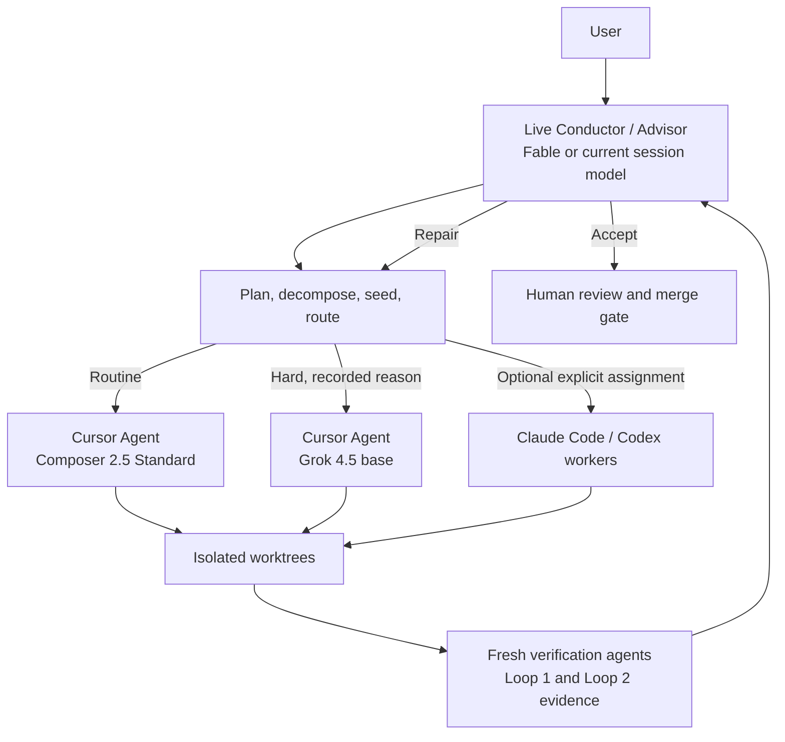
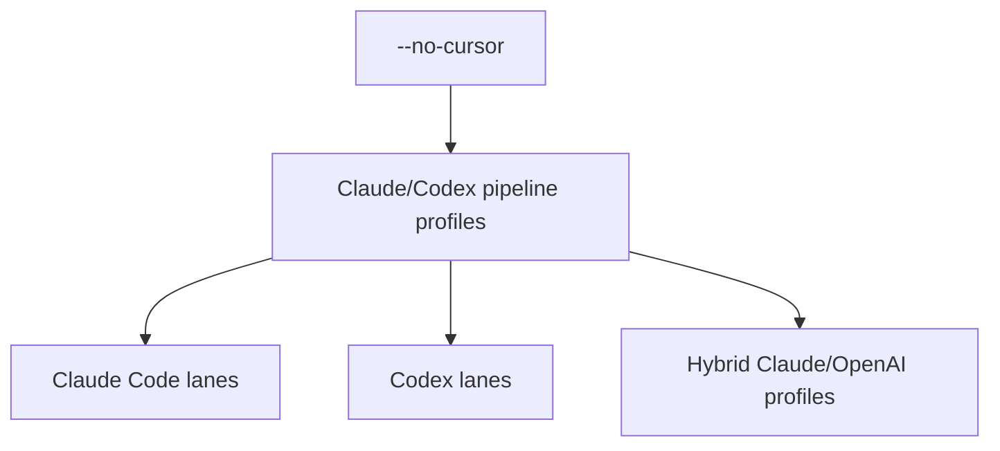

# better-gsd

BGSD is a verified, worktree-based GSD conductor. You start one session with the
model you want to reason with — that live session is the **Conductor and
Advisor**. By default, Pipeline Agents execute through **Cursor Agent CLI**:
Composer 2.5 Standard for routine work and Grok 4.5 base for hard work. You can
instead run **Claude Code / Codex** workers with `--no-cursor` — an equal
alternative, not a fallback. Fresh verification gathers evidence; the Conductor
adjudicates. BGSD never writes directly to your production branch.

## Architecture



### Roles

| Role | Owns | Chosen at |
| --- | --- | --- |
| Conductor | scope, decomposition, seeds, routing reasons, evidence adjudication, human gates | your current live session (never switched by BGSD) |
| Routine workers | contained implementation via `cursor-agent` + Composer 2.5 Standard (`composer-2.5`) | session default when Cursor is enabled |
| Hard workers | ambiguous / cross-cutting work via `cursor-agent` + Grok 4.5 base (`cursor-grok-4.5-high`) | Conductor assignment with recorded reason |
| Claude/Codex workers | Claude Code and/or Codex build & evaluation lanes | `--no-cursor`, or an explicit `claude-codex` assignment |
| Verifiers | deterministic checks first; optional fresh Composer semantic evidence | session policy |
| Human | `next → main` merge and contestable gates | always |

Verification is **deterministic-first**: tests, typecheck, lint, build, and
Playwright run before spawning another model. A fresh Composer verifier is used
only when semantic inspection is necessary. The live Conductor owns final
adjudication — PASS/FAIL evidence is never a silent product decision.

**Fast model variants and Auto are never silently selected.** Doctor fails
closed if Standard versus Fast cannot be distinguished.

## Claude Code / Codex (`--no-cursor`)



```sh
# Default: Cursor workers (Composer routine / Grok hard)
node bgsd/scripts/session.mjs --prompt "Build an audit log"

# Claude Code / Codex workers — equal alternative; zero Cursor probes or spawns
node bgsd/scripts/session.mjs --prompt "Build an audit log" --no-cursor
```

With `--no-cursor`, BGSD uses Claude/Codex profile, routing, proxy,
authentication, build-lane, and evaluation-lane behavior. It does not probe
`cursor-agent`, check Cursor login, install GSD for Cursor, or spawn
Composer/Grok.

## Doctor and setup

BGSD Doctor checks the selected runtime before a session:

- **Cursor (default):** `cursor-agent` on PATH, browser login
  (`cursor-agent login` — API keys rejected), configured Composer Standard and
  Grok base selectors present in `cursor-agent --list-models`, and (for
  Feature/Project) Open GSD installed for Cursor.
- **Claude/Codex (`--no-cursor`):** Claude and/or Codex CLIs + subscription login +
  GSD for those runtimes. Optional CLIProxyAPI only with `--proxy`.

```sh
# Cursor GSD (Feature/Project)
npx -y @opengsd/gsd-core@latest --cursor --global

# Claude Code / Codex runtimes
npx -y @opengsd/gsd-core@latest --claude --global
npx -y @opengsd/gsd-core@latest --codex --global
```

Cursor authentication is subscription/browser-login only. Child processes scrub
`OPENAI_API_KEY`, `ANTHROPIC_API_KEY`, `CLAUDE_API_KEY`, and `CURSOR_API_KEY`.

## Install

```sh
# Claude Code
claude plugin marketplace add filippo-fonseca/better-gsd
claude plugin install bgsd@better-gsd

# Codex
codex plugin marketplace add filippo-fonseca/better-gsd
codex plugin add bgsd@better-gsd
```

## Start a session

Use the `bgsd-sesh` skill. Native selectors cover:

1. **Execution backend** — Cursor workers, or Claude Code / Codex workers
2. Claude/OpenAI profile when using Claude/Codex (or as optional cross-backend)
3. Routing / verification depth as warranted

```sh
node bgsd/scripts/session.mjs \
  --prompt "Build an audit log"

node bgsd/scripts/session.mjs \
  --prompt "Build an audit log" \
  --no-cursor \
  --profile claude-openai \
  --routing fixed
```

## Workflow depth

| Mode | Use it for | Pipeline | Verification |
| --- | --- | --- | --- |
| Quick | one contained correction | Conductor-planned direct workers; no GSD | deterministic checks + Conductor evidence review |
| Feature | a scoped product change | a few worktrees; Loop 2 when needed | per-unit plus integration when applicable |
| Project | multi-surface work | discussion, DAG, waves, full GSD units | Loop 1, Loop 2, evidence to Conductor, human gate |

Work lands on `next`; the merge from `next` to `main` remains human-only.

## Follow-up roadmap

- [#8](https://github.com/filippo-fonseca/better-gsd/issues/8): subscription-safe remote status/control endpoint for Hyperpolymath.
- [#9](https://github.com/filippo-fonseca/better-gsd/issues/9): remote pipeline inspection and control surface.
- [#10](https://github.com/filippo-fonseca/better-gsd/issues/10): desktop/text-editor experience inspired by T3 Code.

The detailed docs live in [bgsd/docs](./bgsd/docs), and the explainer site lives
in [bgsd/site](./bgsd/site).
