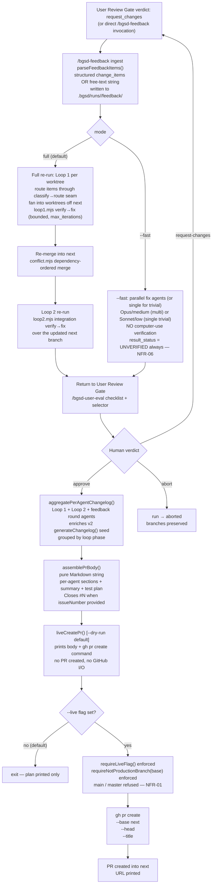

# Feedback Mode + CHANGELOG → PR

When the User Review Gate returns `request_changes`, `/bgsd-feedback` ingests your findings and re-routes them through the fix pipeline. When you approve, `/bgsd-changelog` aggregates every subagent's changes into a PR description and, under an explicit `--live` opt-in, runs `gh pr create` into the standing `next` branch. The guard refuses any PR whose base is `main` or `master` (the production branches). Neither the feedback re-run nor the real PR creation happens without your explicit instruction. The `next` → `main` merge is always a manual, human-only step.

**Default: `--dry-run`.** Feedback ingestion prints the plan without spawning anything. PR creation prints the body and the `gh pr create` command it WOULD run, then exits.

---

## Pipeline



---

## Feedback ingestion

### Sources

Feedback enters through two paths (FEEDBACK-01):

**Path A: structured change_items from `review.json`**

When the User Review Gate returns `request_changes`, the findings captured there (under `change_items`) are passed directly to `/bgsd-feedback`:

```json
{
  "verdict": "request_changes",
  "change_items": [
    { "id": "change-1", "description": "Login crashes on mobile" },
    { "id": "change-2", "description": "Dashboard 404 on /api/metrics" }
  ]
}
```

**Path B: free-text string (direct invocation)**

```bash
node bgsd/scripts/feedback.mjs "Login is broken; Dashboard loads slow"
```

Multi-line text, semicolons, and numbered-list prefixes are split into discrete items automatically.

### Fix item shape

Each parsed item is tagged, id-stable, and file/feature-tagged where possible:

```json
{
  "id":          "fb-bgsd-0001-1-abc123",
  "description": "Login button crashes on mobile",
  "source":      "review_json",
  "file":        null,
  "feature":     "login",
  "severity":    "high",
  "state":       "pending",
  "created_at":  "2026-06-29T14:00:00.000Z"
}
```

Items are written to `.bgsd/runs/<run-id>/feedback/feedback-<timestamp>.json` for the audit trail. Ingestion and parsing are deterministic — no model calls (NFR-05).

---

## Full vs `--fast` re-run

### Full mode (default)

Re-runs the **entire two-loop machine** on the feedback items (FEEDBACK-02). The existing Loop 1 and Loop 2 controllers are reused unchanged — only the work set changes:

1. Route each item through the v1/v2 classify→route seam.
2. Fan items into worktrees off `next`.
3. Run Loop 1 (per-worktree verify→fix) on each worktree.
4. Re-merge into `next` (conflict pre-check + dependency-ordered merge).
5. Re-run Loop 2 (integration verify→fix) over the updated `next` branch.
6. Return to the User Review Gate.

Full mode is bounded by `max_iterations` (default: 5) and the per-run budget cap (NFR-08).

**FeedbackPlan (full mode):**

```json
{
  "run_id":    "bgsd-0001-my-feature",
  "mode":      "full",
  "items":     [ "..." ],
  "re_run": {
    "mode":                  "full",
    "loops":                 ["loop1", "loop2"],
    "verified":              true,
    "verification_skipped":  false,
    "result_status":         "PENDING",
    "max_iterations":        5,
    "budget_cap":            "default",
    "item_count":            2
  },
  "planned_at": "2026-06-29T14:00:00.000Z"
}
```

### `--fast` mode

**SKIPS the loops.** The Conductor spawns fix agents directly off the feedback items with no computer-use verification (FEEDBACK-03):

| Item set | Agent strategy | Model |
|----------|---------------|-------|
| 1 item with severity `low` | Single agent | Sonnet/low |
| Otherwise | Parallel agents | Opus/medium |

The multi/single decision is a deterministic scored choice (item count + severity) — never a model call (NFR-05).

**FeedbackPlan (`--fast` mode):**

```json
{
  "re_run": {
    "mode":                  "fast",
    "loops":                 ["fast_fix"],
    "agent_strategy":        "parallel",
    "model_hint":            "Opus/medium",
    "verified":              false,
    "verification_skipped":  true,
    "result_status":         "UNVERIFIED",
    "max_iterations":        1,
    "budget_cap":            "default"
  }
}
```

### The UNVERIFIED flag (no silent green)

`--fast` deliberately has no Tester pass. bgsd enforces this structurally (NFR-06):

- `re_run.verified = false` — always, in all `--fast` plans.
- `re_run.result_status = "UNVERIFIED"` — always, in all `--fast` results.
- A `--fast` result can **never** carry `result_status = "PASS"` without a real Tester pass from a subsequent full-mode run. This is a structural guarantee, not a convention.
- The run still returns to the User Review Gate after `--fast` fixes. The human is the only verification path for `--fast`.

---

## Per-agent CHANGELOG aggregation

After the human approves at the User Review Gate, `aggregatePerAgentChangelog()` gathers each subagent's changes across all loops and feedback rounds (CHANGELOG-01):

```
aggregatePerAgentChangelog({
  runId:             "bgsd-0001-my-feature",
  worktrees:         [ { unitId, agentId, branch, commits, status, phase, loop, ... } ],
  integrationResult: { verdict, reportPath, defectCount },
  feedbackRounds:    [ { round: 1, itemCount: 2, mode: "full" } ],
})
// → { entries: AgentEntry[], changelog: string }
```

The aggregation:

1. Calls the v2 `generateChangelog()` seed from `rehearsal.mjs` (reused + enriched).
2. Groups agents by loop phase: Loop 1 worktree agents, Loop 2 integration fix agents, feedback round agents.
3. Builds per-agent sections with branch, final status, final phase, and commit SHAs.
4. Appends an integration result section and a feedback rounds summary.

The entire aggregation path is deterministic file I/O — no model calls (NFR-05).

---

## PR body assembly

`assemblePrBody()` renders the aggregated CHANGELOG into a complete Markdown PR description (CHANGELOG-02):

```
assemblePrBody({
  runId:             "bgsd-0001-my-feature",
  slug:              "my-feature",
  prompt:            "Add user auth and dashboard",
  entries:           [...],
  changelog:         "...",
  integrationResult: { verdict: "PASS", reportPath: "..." },
  ledgerPath:        ".bgsd/ledger.md",
  issueNumber:       42,          // appends "Closes #42" when provided
})
// → { title: string, body: string }
```

The assembled body includes:

- **Summary section:** run ID, generation timestamp, agent count and pass rate, integration verdict, prompt excerpt, ledger link.
- **Per-agent CHANGELOG:** one section per agent, grouped by loop phase.
- **Test plan:** a markdown checklist for the reviewer.
- **`Closes #N`:** only when `issueNumber` is provided.

The function is a pure, deterministic string-building step — no I/O to git or GitHub (NFR-05). The same body is surfaced to the human at the User Review Gate terminal output before any PR is opened.

---

## Guarded PR creation

### Two guards, always active

| Guard | Scope | What it prevents |
|-------|-------|-----------------|
| `requireNotProductionBranch(base)` | **Always** (even in dry-run) | PR targeting `main` or `master` (NFR-01) |
| `requireLiveFlag()` | Only for live execution | Accidental automation without explicit human opt-in |

The production-branch guard fires unconditionally, before the `--live` check. A PR targeting `main`/`master` is refused even in dry-run mode; this guard cannot be bypassed. The integration branch `next` is the intended PR base, so it is allowed.

### Dry-run (default)

Without `--live`, `liveCreatePr()` prints the assembled PR body and the `gh pr create` command it WOULD run, then exits cleanly. No PR is created. No GitHub I/O occurs.

```bash
node bgsd/scripts/changelog-pr.mjs
```

Output:

```
======================================================================
bgsd: CHANGELOG → PR (DRY-RUN — no PR created)
======================================================================

  Base branch : next
  Head branch : <run-id>/<unit-slug>
  PR title    : bgsd run: bgsd-0001-my-feature — Add user auth and dashboard...

  -- Would-be PR body --
  [full PR body here]

  -- Command that WOULD run --
  gh pr create --base next ...

  To create the real PR, re-run with --live.
  NFR-01: main/master are NEVER the PR base — this guard is always on.
======================================================================
```

### Live PR creation (human-supervised only)

**Before you run `--live`:**

1. The `base` branch is `next` (the standing integration branch), never `main`/`master`; the guard enforces this unconditionally.
2. The `head` branch is the unit/feature branch the PR brings into `next`.
3. You have reviewed the PR body at the User Review Gate.
4. You are watching the terminal.

**Do NOT add `--live` to CI/CD pipelines.** Real PR creation is a human-supervised, manual step (NFR-10).

```bash
node bgsd/scripts/changelog-pr.mjs --live
```

With `--live` set and `next` as the base branch, `liveCreatePr()` runs:

```
gh pr create --base next \
             --head <run-id>/<unit-slug> \
             --title "bgsd run: bgsd-0001-my-feature — ..." \
             --body "..."
```

The PR URL is printed on success. Only you can merge `next` into `main`, by hand.

---

## Usage

### `/bgsd-feedback`

```bash
# Plan (dry-run, default):
node bgsd/scripts/feedback.mjs --run-id bgsd-0001-my-feature "Login button crashes"

# Plan with --fast:
node bgsd/scripts/feedback.mjs --fast --run-id bgsd-0001-my-feature "Minor typo"

# Execute full re-run (human-supervised):
node bgsd/scripts/feedback.mjs --live --run-id bgsd-0001-my-feature "Login button crashes"

# Execute fast (human-supervised):
node bgsd/scripts/feedback.mjs --live --fast --run-id bgsd-0001-my-feature "Minor typo"
```

Or invoke via the Claude Code slash command:

```
/bgsd-feedback "Login button crashes"
/bgsd-feedback --fast "Minor typo"
```

### `/bgsd-changelog` (PR assembly + creation)

```bash
# Dry-run (default): prints the would-be PR body + command
node bgsd/scripts/changelog-pr.mjs

# Live: create the real PR (human-supervised)
node bgsd/scripts/changelog-pr.mjs --live
```

---

## Arguments

### `/bgsd-feedback`

| Argument | Required | Description |
|----------|----------|-------------|
| `<feedback text>` | Yes (or from `review.json`) | Free-text feedback string. |
| `--run-id <id>` | Yes | The run identifier. |
| `--fast` | No | Skip loops; spawn fix agents with no verification (UNVERIFIED). |
| `--live` | **Human-gated** | Execute the plan. Default is dry-run (prints plan only). |
| `--max-iterations <n>` | No (default: 5) | Loop iteration cap for full mode. |
| `--budget-cap <$>` | Recommended with `--live` | Per-run token/cost cap. |

### `/bgsd-changelog` (PR creation)

| Argument | Required | Description |
|----------|----------|-------------|
| `--run-id <id>` | Yes | The run identifier. |
| `--base <branch>` | Yes | PR base branch. Defaults to the integration branch `next`. Must NOT be `main`/`master`. |
| `--head <branch>` | Yes | PR head branch (the unit/feature branch being brought into `next`). |
| `--issue <n>` | No | Issue number. When provided, appends `Closes #N` to the body. |
| `--live` | **Human-gated** | Create the real PR. Default is dry-run (prints body + command). |

---

## Safety guarantees

| Rule | Detail |
|------|--------|
| **NFR-01 (branch safety)** | Feedback fixes land on `next` and worktree branches only. The PR targets `next` and never `main`/`master`. `requireNotProductionBranch()` fires unconditionally: before `--live`, before any GitHub I/O. Only you merge `next` into `main`, by hand. |
| **NFR-05 (scripts over models)** | Feedback ingestion, routing decision (full/fast/multi/single), CHANGELOG aggregation, and PR body assembly are all deterministic scripts. No model calls in the plan path. |
| **NFR-06 (no silent green)** | `--fast` results are always `UNVERIFIED`. A clean `PASS` requires a real Tester pass from a full-mode run. The run always returns to the human gate after `--fast`. |
| **NFR-08 (bounded autonomy)** | Full-mode re-runs respect `max_iterations` and the per-run budget cap. The multi/single/full/`--fast` decision is a deterministic scored choice, not a model call. |
| **NFR-10 (human-gated live)** | Real re-runs and real PR creation require explicit `--live`. Default is dry-run. `--live` must be in `process.argv` — a CI env var cannot unlock the live path. |

---

## Related files

| Path | Purpose |
|------|---------|
| `bgsd/scripts/feedback.mjs` | Feedback ingestion, item parsing, re-run plan, guarded live execution |
| `bgsd/scripts/changelog-pr.mjs` | Per-agent CHANGELOG aggregation, PR body assembly, guarded `gh pr create` |
| `bgsd/scripts/rehearsal.mjs` | v2 `generateChangelog()` seed (reused + enriched by CHANGELOG aggregation) |
| `bgsd/scripts/loop1.mjs` | Loop 1 controller (reused unchanged in full feedback re-run) |
| `bgsd/scripts/loop2.mjs` | Loop 2 controller (reused unchanged in full feedback re-run) |
| `bgsd/scripts/review.mjs` | User Review Gate (the gate the run returns to after feedback) |
| `bgsd/commands/bgsd-feedback.md` | Slash-command definition for `/bgsd-feedback` |
| `bgsd/commands/bgsd-changelog.md` | Slash-command definition for `/bgsd-changelog` |
| `.bgsd/runs/<run-id>/feedback/` | Per-feedback-round item files (audit trail) |
| `.bgsd/runs/<run-id>/review.json` | Human verdict output (source for change_items) |

---

## Adding this page to the docs site

This page (`bgsd/docs/bgsd-feedback-changelog.mdx`) is valid standalone Mintlify MDX, intentionally kept outside GSD's vendored nav config (`mint.json` / `docs.json`). When a maintainer is ready to surface it, add a group entry to the Mintlify nav config:

```json
{
  "group": "bgsd",
  "pages": [
    "bgsd/docs/quickstart",
    "bgsd/docs/bgsd-verify",
    "bgsd/docs/bgsd-queue",
    "bgsd/docs/bgsd-run",
    "bgsd/docs/bgsd-status",
    "bgsd/docs/bgsd-loop2-review",
    "bgsd/docs/bgsd-feedback-changelog"
  ]
}
```
