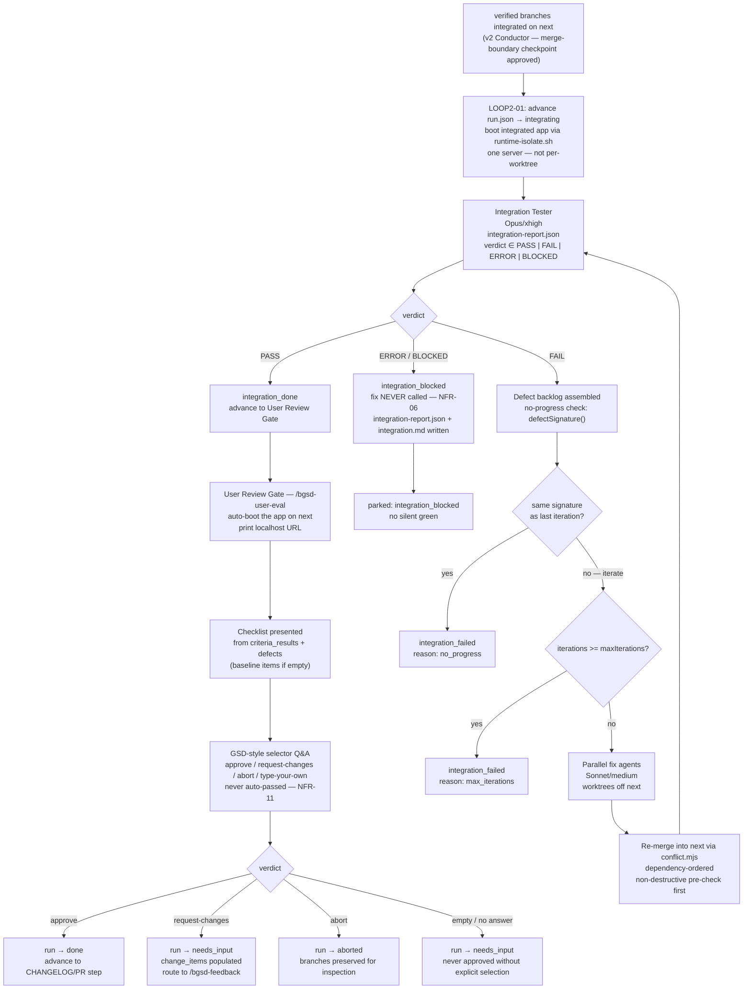

# Loop 2 + User Review Gate — Integration → Human Handoff

After v2's Conductor integrates the verified branches onto the standing **`next`** branch and you approve its merge-boundary checkpoint, v3 takes over. `/bgsd-integrate` (backed by `loop2-live.mjs`) runs **Loop 2** — the integration-level sibling of v1's per-worktree Loop 1, applied to the whole assembled system on `next`. When Loop 2 returns a clean `PASS`, the Conductor opens the **User Review Gate** (`/bgsd-user-eval`): boot the app on `next`, print a checklist, and capture your verdict. Nothing advances automatically. Every step is bounded, reversible, and gated behind `--live`. The `next` → `main` merge is always a manual, human-only step; agents never write to `main`.

**Default: `--dry-run`.** No app is booted, no Tester runs, no fixes are dispatched unless you explicitly pass `--live`.

---

## Pipeline



---

## Loop 2 mechanics

### Overview

Loop 2 is the **integration-level sibling of v1's Loop 1** — "same loop shape, applied twice" (Plan Part 5). Where Loop 1 ran per-worktree (verifying a single unit's work), Loop 2 runs over the WHOLE integrated build on the standing `next` branch, verifying the integrated system across feature boundaries.

The Loop 2 controller (`loop2.mjs`) is a pure, deterministic DI controller. All live operations are dependency-injected:

| Injected boundary | Tests | Live (Phase 2, `loop2-live.mjs`) |
|-------------------|-------|----------------------------------|
| `verify()` | mock returning fixture report | boot the app on `next` + run Integration Tester |
| `fix(defects)` | mock | spawn parallel fix agents in worktrees off `next` |
| `reMerge()` | mock | re-integrate into `next` via `conflict.mjs` dependency-ordered merge |

The controller (`loop2.mjs`) **never spawns processes, boots apps, or runs agents.** All live seams live in `loop2-live.mjs` and are guarded behind `--live`.

### Stop conditions

The loop exits on the first matching condition (LOOP2-04, NFR-06/08):

| Condition | Outcome | `reason` |
|-----------|---------|----------|
| Integration Tester returns `PASS` | `integration_done` | `pass` |
| `BLOCKED` or `ERROR` verdict | `integration_blocked` | `blocked_verdict` / `error_verdict` |
| Same defect signature recurs (no progress) | `integration_failed` | `no_progress` |
| `max_iterations` reached (default: 5) | `integration_failed` | `max_iterations` |
| `fix()` throws | `integration_failed` | `fix_threw` |
| `reMerge()` throws | `integration_failed` | `remerge_threw` |

No-progress detection reuses the v1 `defectSignature()` logic verbatim: a SHA-256 of sorted defect IDs. If the same signature appears in two consecutive iterations, the loop stops immediately rather than burning budget on a stuck fix cycle.

`BLOCKED`/`ERROR` verdicts park the run as `integration_blocked` without ever calling `fix()` — a non-retryable verdict is never retried (NFR-06).

---

## The integration-report shape

The Integration Tester emits `.bgsd/runs/<run-id>/integration-report.json`. It reuses the v0 verification-report contract and adds an `integration` block (LOOP2-02):

```json
{
  "run_id":        "bgsd-0001-my-feature",
  "generated_at":  "2026-06-29T00:00:00.000Z",
  "scope":         "integration",
  "verdict":       "PASS | FAIL | ERROR | BLOCKED",
  "integration": {
    "integration_branch": "next",
    "iteration":          0,
    "scrutiny": {
      "cross_boundary_uat":     true,
      "integrated_diff_review": true,
      "alignment_check":        true,
      "improvement_scrutiny":   true
    }
  },
  "criteria_results": [
    { "id": "AC-01", "description": "...", "source": "...", "status": "passed", "driver": "...", "evidence": "..." }
  ],
  "defects": [
    { "id": "D-01", "severity": "high", "source": "...", "description": "...", "evidence": "...", "criterion_id": "AC-01", "feature": "login", "file": "src/auth.ts" }
  ]
}
```

The `scrutiny` block records which of the four integration checks ran:

| Check | What it verifies |
|-------|-----------------|
| `cross_boundary_uat` | End-to-end user flows that cross feature boundaries |
| `integrated_diff_review` | Code review of the merged diff |
| `alignment_check` | The integrated result matches the original prompt and requirements |
| `improvement_scrutiny` | Feature-interaction smells, polish, and consistency — not only regressions |

The verdict is computed by the v0 `computeVerdict()` contract, reused unchanged.

An integration log is also written to `.bgsd/runs/<run-id>/integration.md` with the full iteration trail and stop reason.

---

## User Review Gate

### How the gate opens

When Loop 2 returns `integration_done`, the Conductor advances the run into a `review` lifecycle state and opens the User Review Gate. It surfaces exactly one consolidated review prompt through the Kiwi channel (REVIEW-01):

```
╔══════════════════════════════════════════════════╗
║  Kiwi  ·  bgsd User Review Gate                  ║
║  /bgsd-user-eval    🔒 main-protected             ║
╚══════════════════════════════════════════════════╝

Run: bgsd-0001-my-feature  |  State: review

── What was built ───────────────────────────────────
  [per-agent CHANGELOG summary]

── Boot ─────────────────────────────────────────────
  Integrated app (next): http://localhost:3099
  (open in your browser to verify by hand)

── Checklist ────────────────────────────────────────
  [ ] User login flow works end-to-end
  [ ] Dashboard loads within 3 seconds
  [ ] Verify defect fixed: API 401 on /profile (src/api/profile.ts)
  [ ] The integrated app loads and responds on the localhost URL

── Verdict ──────────────────────────────────────────
  Your verdict on the integrated build (next) — pick one:

  [approve]          Approve — integration looks good. Advance to PR creation.
  [request-changes]  Request changes — describe what's wrong → /bgsd-feedback.
  [abort]            Abort this run — stop here (branches preserved).
  [other]            Type your own: describe your verdict in free text...
────────────────────────────────────────────────────
  Respond with: approve | request-changes | abort | <your text>
  An unanswered gate parks the run in needs_input — never auto-approved.
```

### Checklist generation

The checklist is generated pure-deterministically from the integration report (REVIEW-02, NFR-05):

1. One item per `criteria_results` entry — the acceptance criterion to verify.
2. One item per `defects` entry — confirm the defect is gone.
3. If neither produces any items, three baseline items are added so the checklist is never empty.

### Selector verdict options

| Option ID | What you type | Outcome |
|-----------|--------------|---------|
| `approve` | `approve` | Run advances to CHANGELOG/PR step. `verdict: "approved"` in `review.json`. |
| `request-changes` | `request-changes` | `change_items` is populated from your findings. Run routes to `/bgsd-feedback`. |
| `abort` | `abort` | Run is parked. Branches are preserved for inspection. |
| `other` (type your own) | Any other text | Treated as `request-changes` with your text captured as findings. |
| (no answer) | Empty / Ctrl-C / closed stdin | Runs parks in `needs_input`. **NEVER approved.** |

### Never-auto-pass rule (NFR-06/11)

The gate is interactive by design and never auto-passes. Concretely:

- The gate state machine is unit-tested with a mocked `promptFn` (e.g. returns `"approve"` in tests) — the entire machine is deterministic with the interactive prompt dependency-injected.
- Passing `null`, `""`, or no answer resolves to `"needs_input"` — NEVER `"approved"`.
- In live runs the real interactive prompt is called. Only an explicit `approve` selection by a human advances the run. No automation can produce `"approved"` without the human typing it.

### review.json

The gate writes `.bgsd/runs/<run-id>/review.json` atomically (tmp + rename):

```json
{
  "run_id":          "bgsd-0001-my-feature",
  "reviewed_at":     "2026-06-29T14:32:00.000Z",
  "verdict":         "approved",
  "checklist_items": [
    { "id": "check-criteria-AC-01", "label": "User login flow works end-to-end", "source": "criteria", "status": "pending" }
  ],
  "free_text":       null,
  "change_items":    []
}
```

`verdict` is always one of: `"approved"` | `"request_changes"` | `"aborted"` | `"needs_input"`.

### /bgsd-status integration

When a run is in `review` or `needs_input` state, `/bgsd-status` shows a distinct badge:

```
── 👁 User Review Gate  [👁 REVIEW]
  ⚠ NEEDS YOUR EVAL:  Run /bgsd-user-eval to boot the app on next and submit your verdict.
```

The `🔒 main-protected` indicator is always visible in the banner: it marks that `main` (production) is never written by an agent.

---

## HUMAN-GATED: the `--live` flag

> **This section is critical. Read it before every live integration run.**

The live path boots the actual integrated app on `next` and drives real Integration-Tester→fix cycles. It is **off by default** and requires an explicit `--live` opt-in.

**Dry-run (always safe, always the default):**

```bash
node bgsd/scripts/loop2-live.mjs
# → HUMAN-GATED refusal; shows the checklist and exits non-zero
```

**Live integration run — work through this checklist every time:**

1. **Branch safety.** You are not on `main`. Integration and fix-agent worktrees target the standing `next` branch; agents never write to `main`.
   ```bash
   git branch --show-current
   ```
2. **Phase 1 controller clean.** `loop2.mjs` ran green under mocked Tester/fix in unit tests.
3. **Budget cap.** Set a per-run token/cost cap:
   ```bash
   --budget-cap 5.00   # or: export BGSD_BUDGET_CAP=5.00
   ```
4. **Stay awake.** `caffeinate -dimsu &` is running so the Mac does not sleep mid-run.
5. **Watch the terminal.** This is NOT fire-and-forget. Kiwi prints iteration progress; you must be present to respond to stop conditions.
6. **Isolation in place.** `runtime-isolate.sh` isolation is configured: the integrated app runs on its own port/DB/env with no shared state with production.
7. **`next` is the integration branch.** Fix-agent worktrees branch off `next` and re-merge into `next`. `main` is NEVER touched by an agent; the `next` → `main` merge is human-only.

**Run the live path:**

```bash
node bgsd/scripts/loop2-live.mjs --live \
  --run-id bgsd-0001-my-feature \
  --rehearsal-branch next \
  --max-iterations 5
```

**For the User Review Gate:**

```bash
# Dry-run (default): show the boot plan + checklist, do NOT boot
node bgsd/scripts/review.mjs --run-id bgsd-0001-my-feature

# Live (human-supervised only): boot the real app on next
node bgsd/scripts/review.mjs --live --run-id bgsd-0001-my-feature
```

Or invoke via the Claude Code slash commands:

```
/bgsd-integrate
/bgsd-user-eval
```

---

## Arguments

### `/bgsd-integrate` (Loop 2)

| Argument | Required | Description |
|----------|----------|-------------|
| `--run-id <id>` | Yes | The run identifier (e.g. `bgsd-0001-my-feature`). |
| `--rehearsal-branch <branch>` | No (default: `next`) | The standing integration branch to run Loop 2 against. |
| `--max-iterations <n>` | No (default: 5) | Hard cap on fix→re-merge→re-verify cycles (LOOP2-04). |
| `--live` | **Human-gated** | Engage the real live integration path. See checklist above. |
| `--budget-cap <$>` | Recommended with `--live` | Per-run token/cost cap (also `BGSD_BUDGET_CAP`). |

### `/bgsd-user-eval` (User Review Gate)

| Argument | Required | Description |
|----------|----------|-------------|
| `--run-id <id>` | Yes | The run identifier. |
| `--port <n>` | No (default: 3099) | Port to boot the integrated app (on `next`) on. |
| `--live` | **Human-gated** | Boot the real app on `next`. Default is dry-run (no boot). |

---

## Safety guarantees

| Rule | Detail |
|------|--------|
| **NFR-01 (branch safety)** | Agents never write to `main`. Fix-agent branches and re-merges all target the standing `next` branch. Only you merge `next` into `main`, by hand. |
| **NFR-06 (no silent green)** | `BLOCKED`/`ERROR` verdicts park immediately without calling fix. Loop 2 ends in a structured non-PASS terminal state with `integration-report.json` attached. The User Review Gate is never auto-passed (NFR-11). |
| **NFR-08 (bounded, reversible autonomy)** | Loop 2 is bounded by `max_iterations`; feedback re-runs are equally bounded; the per-run budget cap limits model spend. |
| **NFR-10 (live integration run is human-gated)** | Real booting and real Tester→fix cycles are exercised only under explicit `--live` opt-in, human-supervised, never in CI, `main` never written by an agent. `--dry-run` is the default. |
| **NFR-11 (User Review Gate is interactive-by-design)** | The gate uses GSD-style selector Q&A and never auto-passes. An unanswered gate parks in `needs_input`, never `done`. |

---

## Related files

| Path | Purpose |
|------|---------|
| `bgsd/scripts/loop2.mjs` | Loop 2 controller (pure DI, no process spawning) |
| `bgsd/scripts/loop2-live.mjs` | Live seam (real app boot + Tester + fix agents, guarded behind `--live`) |
| `bgsd/scripts/review.mjs` | User Review Gate: checklist, selector Q&A, `review.json` writer |
| `bgsd/scripts/conflict.mjs` | Dependency-ordered re-merge after fixes |
| `bgsd/scripts/run.mjs` | Run lifecycle state machine (`integrating`, `review`, `needs_input` states) |
| `bgsd/scripts/status.mjs` | Live status view (review/needs-input badge) |
| `bgsd/commands/bgsd-integrate.md` | Slash-command definition for `/bgsd-integrate` |
| `bgsd/commands/bgsd-user-eval.md` | Slash-command definition for `/bgsd-user-eval` |
| `.bgsd/runs/<run-id>/integration-report.json` | Integration Tester output (source of truth) |
| `.bgsd/runs/<run-id>/integration.md` | Integration iteration log (stop reason + trail) |
| `.bgsd/runs/<run-id>/review.json` | Human verdict output |

---

## Adding this page to the docs site

This page (`bgsd/docs/bgsd-loop2-review.mdx`) is valid standalone Mintlify MDX, intentionally kept outside GSD's vendored nav config (`mint.json` / `docs.json`). When a maintainer is ready to surface it, add a group entry to the Mintlify nav config:

```json
{
  "group": "bgsd",
  "pages": [
    "bgsd/docs/quickstart",
    "bgsd/docs/bgsd-verify",
    "bgsd/docs/bgsd-queue",
    "bgsd/docs/bgsd-run",
    "bgsd/docs/bgsd-status",
    "bgsd/docs/bgsd-loop2-review",
    "bgsd/docs/bgsd-feedback-changelog"
  ]
}
```
