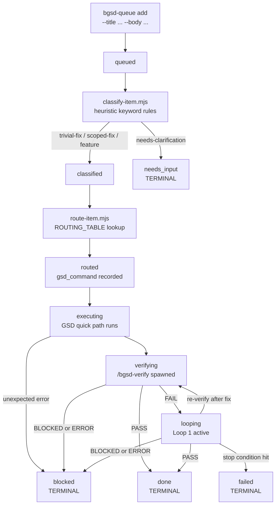

# /bgsd-queue

`/bgsd-queue` is bgsd's persistent fix-stream. You feed it items; it classifies each one, routes it to the right GSD quick path, executes it, verifies it with `/bgsd-verify`, and on defects runs a bounded verify→fix loop until the item passes or a stop condition fires. Exactly one item is active at a time.

The same store doubles as the Conductor's **cross-session backlog**. When you defer scope mid-session, Kiwi enqueues it; when you run `/bgsd-sesh` with no prompt, or when a session finishes, Kiwi proposes the next backlog item via a selector. Two read/resolve subcommands back that loop:

- **`peek`** prints the next queued backlog item (read-only), or an empty marker. It is what the Conductor proposes on a no-prompt sesh and at sesh end.
- **`done <id>`** marks a Conductor-pulled item resolved (`done`, or `--failed`/`--blocked`) out-of-band of the autonomous drainer, so a backlog item is not re-proposed once it has been run as a full session.

So there are two ways to drain: `start` is the autonomous drainer (each item through the quick pipeline, no confirmation), while `peek` + `done` are the Conductor-orchestrated backlog (Kiwi peeks, proposes via a selector, runs a properly-scaled session, then resolves the item).

---

## Fix-stream lifecycle



---

## Subcommands

| Subcommand | What it does | Example |
|---|---|---|
| `add` | Append a fix or feature item to the queue. Returns the item id. Deduplicates by SHA-256 content key (title+body). | `node bgsd/scripts/queue.mjs add --title "Fix nav bug on mobile" --body "Collapses incorrectly below 768 px." --source manual` |
| `status` | Print a compact, read-only queue summary: per-state counts, current item, last verdict. Zero model calls. | `node bgsd/scripts/queue.mjs status` |
| `start` | Drain the queue: pull the first non-terminal item and run it through the full pipeline. Resumes in-flight items; skips done ones. Pass `--dry-run` to preview without mutating state. | `node bgsd/scripts/queue.mjs start [--dry-run]` |

### `status` output

```
bgsd queue status
  total        5
  queued       1
  classified   0
  routed       0
  executing    0
  verifying    0
  looping      0
  done         3
  failed       1
  blocked      0
  needs_input  0

  current      [queued] item-a3f2c1b0-…  "Fix nav bug on mobile"  age=2m
  last_verdict  done
```

---

## State machine

Each item moves through exactly one path. Every transition is timestamped and appended to the item's `trail` array — the audit trail is append-only and survives interruption.

| State | Description |
|---|---|
| `queued` | Item added; not yet classified. |
| `classified` | Route class assigned (`trivial-fix`, `scoped-fix`, `feature`, `needs-clarification`). |
| `routed` | Concrete GSD command selected and recorded (`gsd_command` field). |
| `executing` | GSD quick-path execution running in the worktree. |
| `verifying` | `/bgsd-verify` running against the worktree's isolated instance. |
| `looping` | Verify→fix loop iterating after a Tester `FAIL`. |
| `done` | **TERMINAL.** Clean Tester `PASS` received. |
| `failed` | **TERMINAL.** Stop condition hit without a clean `PASS`. |
| `blocked` | **TERMINAL.** Tester returned `BLOCKED` or `ERROR`. |
| `needs_input` | **TERMINAL (soft).** Item is ambiguous; drainer advances to next item. |

**Durability and resumability.** The store at `.bgsd/queue/queue.json` is written atomically (write temp file, then rename) so it survives interruption at any point. Re-running `start` skips terminal items, picks up non-terminal items from their last persisted state, and increments the `attempts` counter each pass.

**Content-key deduplication.** `add` computes a SHA-256 of `title + body` before writing. If a non-terminal item with the same key already exists, `add` returns its id without creating a duplicate record.

---

## Classification rules

`classify-item.mjs` runs a deterministic, keyword/heuristic classifier: no model call, no network call. A Haiku model seam is documented in the source for future activation (Part 11).

| Route class | Classifier signal | What happens |
|---|---|---|
| `trivial-fix` | Typo, spelling, formatting, whitespace, dead code, cosmetic — high-confidence cosmetic indicators | Routes to `/gsd-fast` |
| `scoped-fix` | Fix, bug, crash, regression, error, 404, TypeError, revert — bounded bug signals | Routes to `/gsd-quick` |
| `feature` | Add, new, implement, create, enhance, refactor, migrate, endpoint, dashboard — capability signals | Routes to `/gsd-plan-phase` + `/gsd-execute-phase` chain |
| `needs-clarification` | Title is too vague (e.g. just "fix", "bug", "update") or ends with "?" | Parks item in `needs_input`; drainer advances to next item |

---

## Classification→routing table

Source of truth: `ROUTING_TABLE` in `bgsd/scripts/route-item.mjs`.

| Route class | GSD command | Chain | Model profile | Effort |
|---|---|---|---|---|
| `trivial-fix` | `/gsd-fast` | (none) | `fast` | low |
| `scoped-fix` | `/gsd-quick` | (none) | `balanced` | medium |
| `feature` | `/gsd-plan-phase` | `/gsd-execute-phase` | `quality` | high |

The router also writes the model posture to `.planning/config.json` (`model_profile` key) via the config seam. This is the only thing bgsd writes to the planning directory; it never edits vendored GSD (NFR-03/04).

**Difficulty score escalation.** `route-item.mjs` computes a cheap difficulty score from body length, title word count, and prior attempt count. If the score exceeds 0.7 and the item has had more than one prior attempt, the model profile is bumped one tier (`fast → balanced`, `balanced → quality`) before the config is written.

---

## Loop 1 — verify→fix behavior

After GSD execution completes, the drainer enters the Loop 1 controller (`loop1.mjs`). The verify and fix functions are injected (pure controller logic, no process spawning in `loop1.mjs` itself).

**Algorithm:**

1. Call `verify()`. Returns `{ verdict, defects[] }`.
2. `PASS`: advance item to `done`. Stop.
3. `BLOCKED` or `ERROR`: advance item to `blocked`. Stop. Never retry a non-retryable verdict.
4. Compute a stable defect signature (SHA-256 of sorted defect ids).
5. If this signature matches the previous iteration's signature: no progress detected. Advance to `failed` with `reason: no_progress`. Stop.
6. Call `fix(defects, { effort, model })`.
7. Increment iteration counter. If `iterations >= maxIterations`: advance to `failed` with `reason: max_iterations`. Stop.
8. Return to step 1.

**Stop conditions (LOOP-03, NFR-06/07):**

| Stop condition | Terminal state | `reason` recorded on trail |
|---|---|---|
| Tester `PASS` | `done` | `pass` |
| `maxIterations` reached (default: 5) | `failed` | `max_iterations` |
| Same defect signature recurs across iterations | `failed` | `no_progress` |
| Tester returns `BLOCKED` or `ERROR` | `blocked` | `blocked_verdict` / `error_verdict` |
| `fix()` throws unexpectedly | `failed` | `fix_threw` |

**Escalation ladder (LOOP-05).** After `escalateAfterIters` failed fix attempts (default: 2), the effort band bumps one level (`low → medium → high`). After `escalateModelAfterIters` attempts (default: 4), the model tier bumps (`fast → balanced → quality`). Both are recorded on the audit trail.

> **Human-gated live run.** `loop1.mjs` is pure controller logic with no process spawning. The real implementations of `verify()` (spawn `/bgsd-verify`, parse `verification-report.json`) and `fix()` (route to `/gsd-*` execution in a worktree) live in `loop1-live.mjs` and are **guarded behind `--live`**. They refuse to run without that explicit flag. This is the "no silent green" invariant: an item is never marked `done` without a verified Tester `PASS`.

---

## Queue store

**Location:** `.bgsd/queue/queue.json` (created automatically on first `add`; gitignored — runtime state is never committed).

**Format:** `{ "items": [ ... ] }`. Each item carries:

| Field | Description |
|---|---|
| `id` | Stable unique identifier (`item-<8hex>-<timestamp>`) |
| `content_key` | SHA-256 of `title\n\nbody` — dedup key |
| `title` | Short human-readable title |
| `body` | Longer description (may be empty) |
| `source` | `"manual"` or `"hyperpolymath"` |
| `state` | Current state (see state machine above) |
| `attempts` | Drainer pass count |
| `created_at` | ISO-8601 timestamp |
| `updated_at` | ISO-8601 timestamp (set on every transition) |
| `trail` | Append-only array of `{ from, to, at, meta? }` transition entries |

---

## Hard rules

| Rule | Detail |
|---|---|
| No silent green (NFR-06) | An item reaches `done` only on a verified Tester `PASS`. Every non-clean stop produces a structured terminal state (`failed` or `blocked`). |
| No model calls in queue I/O (NFR-05) | `add`, `status`, and the store read/write path are deterministic scripts. |
| Single-stream, single-worktree (QUEUE-04) | Exactly one item is active at a time; no parallelism; no second worktree. |
| Branch safety (NFR-01) | bgsd writes only into `.bgsd/` and `bgsd/`. Agents never write to `main`; integration lands on the standing `next` branch, and `next` → `main` is human-only. |
| Additive only (NFR-02/03) | Queue is fully contained under `bgsd/` and `.bgsd/`. No vendored GSD files are modified. |

---

## Quick reference

| Task | Command |
|---|---|
| Add item | `node bgsd/scripts/queue.mjs add --title "..." [--body "..."] [--source manual]` |
| Check status | `node bgsd/scripts/queue.mjs status` |
| Drain queue | `node bgsd/scripts/queue.mjs start` |
| Dry-run drain | `node bgsd/scripts/queue.mjs start --dry-run` |
| Classify only | `node bgsd/scripts/classify-item.mjs --title "..." [--body "..."]` |
| Route only | `node bgsd/scripts/route-item.mjs --class trivial-fix` |
| Run unit tests | `node bgsd/scripts/test-queue.mjs` |

---

## Related files

| Path | Purpose |
|---|---|
| `bgsd/scripts/queue.mjs` | Core queue library + CLI (add/status/start) |
| `bgsd/scripts/classify-item.mjs` | Heuristic keyword classifier (route-class assignment) |
| `bgsd/scripts/route-item.mjs` | ROUTING_TABLE + model posture writer |
| `bgsd/scripts/loop1.mjs` | Loop 1 controller (pure; injectable verify/fix) |
| `bgsd/scripts/loop1-live.mjs` | Live process-spawning implementations (human-gated, `--live` required) |
| `bgsd/commands/bgsd-queue.md` | Slash command definition |
| `bgsd/commands/bgsd-verify.md` | Tester command (Loop 1 output contract) |
| `.bgsd/queue/queue.json` | Runtime queue store (gitignored) |

---

## Adding this page to the docs site

This page (`bgsd/docs/bgsd-queue.mdx`) is valid standalone Mintlify MDX, intentionally kept outside GSD's vendored nav config (`mint.json` / `docs.json`). When a maintainer is ready to surface it, add a group entry to the Mintlify nav config:

```json
{
  "group": "bgsd",
  "pages": ["bgsd/docs/quickstart", "bgsd/docs/bgsd-verify", "bgsd/docs/bgsd-queue", "bgsd/docs/hyperpolymath-capture"]
}
```
