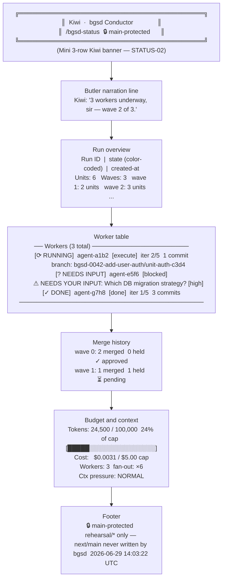

# /bgsd-status — Kiwi Live Status View

`/bgsd-status` renders a colorful, read-only snapshot of every active run, worker, and merge boundary. It reads `.bgsd/runs/<run-id>/run.json` and `.bgsd/runs/<run-id>/control/<agent-id>.json` — the exact same files the Conductor writes — and renders them through `bgsd/scripts/status.mjs`. Zero model calls, zero process spawning.

---

## View layout



---

## What the view shows

| Section | Content |
|---------|---------|
| **Kiwi banner** | Mini 3-row banner with the `🔒 main-protected` indicator at all times. |
| **Butler narration** | One-line Kiwi summary: active workers, wave progress, or "your attention is required" — in the British-butler voice. |
| **Run overview** | Run ID, lifecycle state (color-coded), unit count, wave count, per-wave unit breakdown, latest checkpoint status. |
| **Worker table** | Every worktree: color-coded badge, current GSD phase, Loop 1 iteration `iter N/5`, commit count, branch name, any open blocker or escalation. |
| **Merge history** | Per-wave checkpoint: merged count, held count, go/no-go decision. |
| **Budget and context** | Running tokens vs per-run cap (with a progress bar), estimated cost, active parallelism and fan-out multiplier, context-pressure level, downshift indicator. |
| **Footer** | `🔒 main-protected` reminder + UTC timestamp. |

---

## Color-coded state badges

| Badge | Color | Meaning |
|-------|-------|---------|
| `[⟳ RUNNING]` | Bright yellow | Worker is executing. |
| `[⏸ BLOCKED]` | Yellow | Worker hit a hard blocker; Conductor is trying to answer from context. |
| `[? NEEDS INPUT]` | Bright cyan | Unanswerable blocker: **your attention is required**. |
| `[✓ DONE]` | Bright green | Worker finished Loop 1; ready to merge. |
| `[✗ FAILED]` | Bright red | Worker failed; branch is held back. |
| `[⏸ STALLED]` | Yellow | Heartbeat stale; not yet dead. |

Workers in `needs_input` are sorted to the **top** of the table and highlighted in bright cyan with the open question visible. "Where input is needed" is never buried.

**Run-state colors:**

| State | Color |
|-------|-------|
| `created` | Dim |
| `decomposed` | Cyan |
| `spawning`, `executing`, `verifying` | Bright yellow |
| `merging` | Magenta |
| `checkpoint` | Bright cyan |
| `done` | Bright green |
| `aborted` | Bright red |
| `blocked`, `needs_input` | Bright cyan |

---

## How "where input is needed" surfaces

The worker table sorts agents in this priority order: `needs_input` first, then `blocked`, then `stalled`, then `running`, then `failed`, then `done`. The open question is printed directly under the agent row in bright cyan:

```
[? NEEDS INPUT]  agent-e5f6  [blocked]
        ⚠ NEEDS YOUR INPUT: Which DB migration strategy? [high]
```

Open blockers (not yet escalated to you) appear in yellow:

```
[⏸ BLOCKED]  agent-b2c3  [blocked]
        ⛔  BLOCKED: Which API response format? [high]
```

The Conductor reads the blocker and tries to answer from context (REQUIREMENTS, codebase, prior runs). If it can answer, it writes the answer to `<agent-id>.inbox.md`, resolves the blocker, and the worker resumes automatically. Only unanswerable blockers reach `needs_input` and surface to you.

---

## `--watch` live refresh

```bash
# Refresh every 3 seconds (default):
node bgsd/scripts/status.mjs --watch

# Custom interval (in seconds):
node bgsd/scripts/status.mjs --watch 5

# Target a specific run:
node bgsd/scripts/status.mjs --run-id bgsd-0042-add-user-auth --watch
```

The watch loop re-reads `run.json` and all control files on every tick. It never spawns any process, never calls a model, and exits cleanly on `Ctrl-C` (SIGINT/SIGTERM).

In a color terminal, each refresh clears the screen (`\x1b[2J\x1b[H`) and re-renders from the top. In non-TTY or `NO_COLOR` mode, each refresh appends a new snapshot to stdout.

---

## NO_COLOR and non-TTY behavior

`/bgsd-status` respects three signals:

| Signal | Effect |
|--------|--------|
| `NO_COLOR=1` | All ANSI sequences stripped; badges render as `[? NEEDS INPUT]` in plain text. |
| `CI=true` | Same as `NO_COLOR`. |
| Non-TTY stdout (piped or redirected) | Color automatically disabled (`process.stdout.isTTY` is falsy). |

The structured layout — section headers, indentation, separators — remains fully legible in plain mode. Every badge label, state name, and indicator is present; just without color. This makes `/bgsd-status` safe to pipe or redirect in any environment.

---

## Budget and context telemetry

The telemetry section shows:

- **Tokens:** running count vs per-run cap, with a 20-char progress bar (`green → yellow → red` as you approach the cap).
- **Cost:** estimated spend in USD vs the cap.
- **Workers:** active parallelism count and the fan-out multiplier (parallelism × each worker's GSD sub-agent fan-out).
- **Ctx pressure:** `NORMAL` (bright green), `ELEVATED` (yellow), or `CRITICAL` (bright red) — derived from the Conductor's `estimatePressure()` in `context.mjs`.
- **Downshift indicator:** when the Conductor has triggered a graceful downshift (reducing effort or model tier to stay within budget), the reason is printed in bright yellow and is never silent.

Telemetry data is supplied by the Conductor at runtime. If no telemetry is available yet (e.g., a freshly created run), the section reads `"Budget & context telemetry not yet available."`.

---

## The Kiwi butler voice

Kiwi is bgsd's Conductor — codenamed after the bird, with a British-butler / JARVIS persona: courteous, calm, conspicuously competent, and occasionally touched with confident modern slang.

The butler voice lives in the **narration line only** — the one-line summary rendered by `kiwiNarration()` in `status.mjs`. Examples:

| Run state | Kiwi narration |
|-----------|---------------|
| `decomposed` | `"Kiwi is decomposing your prompt, sir — the dependency graph is being assembled."` |
| `executing` | `"3 workers underway, sir — wave 2 of 3."` |
| `checkpoint` | `"Kiwi needs your go/no-go at the merge boundary, sir. Please review and respond."` |
| `done` | `"Run complete, sir — 4 units merged successfully. Rehearsal branch is ready for inspection."` |
| `aborted` | `"Run aborted, sir. All branches and control files have been preserved."` |

**Structured outputs are never in-character.** Badge labels, state names, verdicts, JSON reports, and YAML fields stay strictly literal. The butler voice is a costume on top of rigorous state rendering, not a substitute for it. A `FAILED` unit is rendered as `[✗ FAILED]`, not softened to anything else.

---

## Usage

### One-shot status

```bash
# Uses the most-recent run (reads .bgsd/ledger.md):
/bgsd-status
# or:
node bgsd/scripts/status.mjs

# Target a specific run:
node bgsd/scripts/status.mjs --run-id bgsd-0042-add-user-auth

# Override the .bgsd directory:
node bgsd/scripts/status.mjs --bgsd-dir /path/to/.bgsd
```

Renders a single snapshot and exits. Reads `.bgsd/runs/<latest-run-id>/run.json` and `.bgsd/runs/<latest-run-id>/control/*.json`.

### Live watch

```bash
node bgsd/scripts/status.mjs --watch        # refresh every 3s
node bgsd/scripts/status.mjs --watch 5      # refresh every 5s
```

---

## Implementation notes

- **Renderer:** `bgsd/scripts/status.mjs` exports `renderStatus({ run, agents, telemetry }) -> string` as a pure function. Inputs are fully injectable; tests assert deterministic output under `NO_COLOR=1`.
- **State source:** reads `.bgsd/runs/<run-id>/run.json` (lifecycle) and `.bgsd/runs/<run-id>/control/<agent-id>.json` (per-worker). The view never diverges from the Conductor's source of truth.
- **No model calls:** the entire view path is deterministic scripts (NFR-05). The watch loop is a thin `loadStatus() + renderStatus()` polling wrapper that never spawns anything.
- **Most-recent run:** when no `--run-id` is given, `findLatestRunId()` scans `.bgsd/runs/` for the entry with the latest `created_at`.

---

## Related commands

| Command | What it does |
|---------|--------------|
| `/bgsd-run "<prompt>"` | Start a new project orchestration run. |
| `/bgsd-abort` | Stop an in-flight run cleanly; all branches and control files are preserved. |
| `/bgsd-clean-branches` | Prune `rehearsal/*` branches already merged into the base branch; never deletes an unmerged branch. |

---

## Related files

| Path | Purpose |
|------|---------|
| `bgsd/scripts/status.mjs` | Pure renderer + state loader + watch loop |
| `bgsd/scripts/ui.mjs` | ANSI color primitives, badge definitions, `COLOR_OK` |
| `bgsd/PERSONALITY.md` | Kiwi voice contract (butler narration vs structured output) |
| `bgsd/commands/bgsd-status.md` | Slash-command definition |
| `.bgsd/runs/<run-id>/run.json` | Run lifecycle state (source of truth) |
| `.bgsd/runs/<run-id>/control/` | Per-worker control files (source of truth) |

---

## Adding this page to the docs site

This page (`bgsd/docs/bgsd-status.mdx`) is valid standalone Mintlify MDX, intentionally kept outside GSD's vendored nav config (`mint.json` / `docs.json`). When a maintainer is ready to surface it, add a group entry to the Mintlify nav config:

```json
{
  "group": "bgsd",
  "pages": [
    "bgsd/docs/quickstart",
    "bgsd/docs/bgsd-verify",
    "bgsd/docs/bgsd-queue",
    "bgsd/docs/bgsd-run",
    "bgsd/docs/bgsd-status"
  ]
}
```
