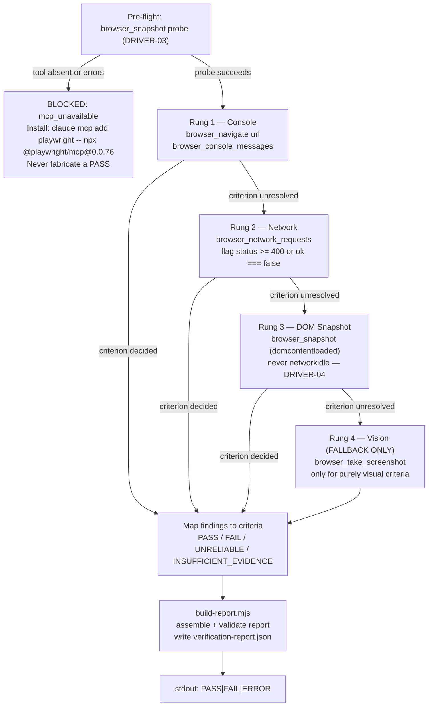

# /bgsd-verify

Boot or attach to a running app, verify it against acceptance criteria, and write a schema-validated `verification-report.json`. The only output to stdout is a single verdict line; the full JSON report lands on disk.

**Stdout contract:**
```
PASS|FAIL|ERROR  .bgsd/runs/<run-id>/verification-report.json
```

---

## Arguments

| Argument | Required | Description |
|---|---|---|
| `<url>` | One of `<url>` or `--boot` | Verify an already-running app at this URL (e.g. `http://localhost:3000`). |
| `--boot <app-dir>` | One of `<url>` or `--boot` | Boot one isolated instance via `runtime-isolate.sh`, then verify it. Tears down automatically after the run. |
| `--criteria <file>` | One of `--criteria` or `--inline` | Acceptance criteria from a GSD `UI-SPEC.md` or acceptance file (Markdown checklist or success-criteria bullets). |
| `--inline "..."` | One of `--criteria` or `--inline` | Acceptance criteria given inline. Separate multiple criteria with `;` or newlines. Quote the whole string. |

---

## Acceptance-criteria input formats

### From a file (`--criteria`)

Pass any GSD `UI-SPEC.md` or acceptance Markdown file. The parser (`bgsd/scripts/parse-criteria.mjs`) recognizes:

**Checklist bullets** (GSD standard):
```markdown
## Acceptance Criteria
- [ ] Page loads without console errors
- [ ] Navigation renders all top-level links
- [ ] Hero heading is visible and non-empty
```

**Success-criteria bullets** (prose list):
```markdown
## Success Criteria
- The page title matches the brand name.
- No 4xx or 5xx network responses for primary resources.
```

Both forms are parsed into the same normalized JSON array. Each criterion receives a stable ID (`CRIT-01`, `CRIT-02`, ...) in document order.

Example parsed output (`criteria.json`):
```json
[
  { "id": "CRIT-01", "description": "Page loads without console errors", "source": "acceptance.md" },
  { "id": "CRIT-02", "description": "Navigation renders all top-level links", "source": "acceptance.md" },
  { "id": "CRIT-03", "description": "Hero heading is visible and non-empty", "source": "acceptance.md" }
]
```

### Inline (`--inline`)

For ad-hoc runs without a file. Separate multiple criteria with `;` or newlines:

```bash
/bgsd-verify http://localhost:3000 \
  --inline "Page loads without console errors; Nav renders correctly; CTA button is present"
```

The same IDs (`CRIT-01`, `CRIT-02`, ...) are assigned in order. `source` is set to `"inline"`.

---

## The report schema

Every run writes `.bgsd/runs/<run-id>/verification-report.json` — a schema-validated object (JSON Schema draft-07, `bgsd/schemas/verification-report.schema.json`).

### Top-level fields

| Field | Type | Description |
|---|---|---|
| `run_id` | `string` | Unique run identifier (ISO-8601 timestamp, e.g. `20240101T120000Z`). |
| `generated_at` | `string` | ISO-8601 timestamp of when the report was assembled. |
| `verdict` | `"PASS"` / `"FAIL"` / `"ERROR"` | Top-level verdict. `FAIL` if any criterion failed or a critical/high defect exists. `ERROR` if the run was blocked or encountered an unrecoverable error. `PASS` otherwise. |
| `environment` | `object` | Runtime metadata: `url`, `port`, `db`, `node_env`, `framework`, `build_mode`. See below. |
| `criteria` | `array` | Per-criterion verification results. One entry per acceptance criterion (REPORT-01). |
| `defects` | `array` | Actionable defects detected during the run (REPORT-02). |
| `screenshots` | `array` | Sparse screenshot index: initial load and defect evidence only (REPORT-02). |
| `driver_ladder` | `object` | Audit of which rungs ran and how many findings each produced (REPORT-03). |

### `environment` object

| Field | Type | Description |
|---|---|---|
| `url` | `string` | The target URL that was verified. |
| `port` | `integer \| null` | TCP port (null if a full URL was provided without `--boot`). |
| `db` | `string \| null` | `DATABASE_URL` used during the run (may be redacted). |
| `node_env` | `string \| null` | `NODE_ENV` during the run (`"development"`, `"production"`, `"test"`). |
| `framework` | `string \| null` | Detected framework (`"nextjs"`, `"vite"`, `"cra"`, `"remix"`, ...). |
| `build_mode` | `"development"` / `"production"` / `null` | Affects `console_reliable` interpretation (see DRIVER-04). |

### `criteria[]` items

Each entry corresponds 1:1 to an acceptance criterion. No criterion is omitted; no entry exists without a criterion (VERIFY-02).

| Field | Type | Description |
|---|---|---|
| `id` | `string` | Stable criterion ID (`CRIT-01`, `CRIT-02`, ...). |
| `description` | `string` | Human-readable criterion text. |
| `source` | `string` | File path or `"inline"`. |
| `status` | `"pass"` / `"fail"` / `"skip"` | Verification outcome. |
| `driver` | `"console"` / `"network"` / `"dom"` / `"vision"` / `"none"` | Which ladder rung produced the deciding evidence. |
| `evidence` | `null \| string \| object` | Raw evidence from the capture, or null for skipped criteria. |

### `defects[]` items

| Field | Type | Description |
|---|---|---|
| `id` | `string` | Stable defect ID (`DEF-01`, `DEF-02`, ...). |
| `severity` | `"critical"` / `"high"` / `"medium"` / `"low"` | Defect severity. |
| `source` | `"console"` / `"network"` / `"dom"` / `"vision"` | Which rung surfaced this defect. |
| `description` | `string` | Human-readable defect description. |
| `evidence` | `null \| string \| object` | Raw evidence from the capture. |
| `criterion_id` | `string \| null` | The criterion this defect maps to, or null for global defects. |

### `screenshots[]` items

| Field | Type | Description |
|---|---|---|
| `label` | `string` | Human-readable label (e.g. `"initial-load"`, `"defect-CRIT-02"`). |
| `path` | `string` | Relative path to the screenshot file within the run directory. |

### `driver_ladder` object

Four fixed keys, one per rung:

| Key | Shape | Description |
|---|---|---|
| `console` | `{ ran: bool, findings: int }` | Console-messages rung. |
| `network` | `{ ran: bool, findings: int }` | Network-requests rung. |
| `dom` | `{ ran: bool, findings: int }` | DOM snapshot rung. |
| `vision` | `{ ran: bool, findings: int }` | Screenshot/vision rung (fallback only). |

### Annotated JSON example

```json
{
  "run_id": "20240101T120000Z",
  "generated_at": "2024-01-01T12:00:05.000Z",
  "verdict": "FAIL",
  "environment": {
    "url": "http://localhost:3001",
    "port": 3001,
    "db": null,
    "node_env": "development",
    "framework": "nextjs",
    "build_mode": "development"
  },
  "criteria": [
    {
      "id": "CRIT-01",
      "description": "Page loads without console errors",
      "source": "acceptance.md",
      "status": "fail",
      "driver": "console",
      "evidence": {
        "type": "error",
        "text": "Warning: validateDOMNesting(...): <div> cannot appear as a descendant of <p>."
      }
    }
  ],
  "defects": [
    {
      "id": "DEF-01",
      "severity": "high",
      "source": "console",
      "description": "React validateDOMNesting: <div> nested inside <p> — invalid HTML nesting",
      "evidence": {
        "type": "error",
        "text": "Warning: validateDOMNesting(...): <div> cannot appear as a descendant of <p>."
      },
      "criterion_id": "CRIT-01"
    }
  ],
  "screenshots": [
    { "label": "initial-load", "path": "screenshot.png" }
  ],
  "driver_ladder": {
    "console": { "ran": true, "findings": 1 },
    "network": { "ran": true, "findings": 0 },
    "dom":     { "ran": true, "findings": 0 },
    "vision":  { "ran": false, "findings": 0 }
  }
}
```

---

## Driver-ladder behavior

The tester executes four rungs in strict order — cheapest and most reliable first. Each rung produces evidence; the command falls through to heavier rungs only when cheaper ones cannot decide a criterion.



### Pre-flight MCP probe (DRIVER-03)

Before any acceptance criterion is touched, the tester calls `browser_snapshot` as a no-op reachability check. If the tool is absent, errors, or times out, the run halts immediately and emits:

```json
{
  "verdict": "BLOCKED",
  "reason": "mcp_unavailable",
  "message": "Playwright MCP tools are not reachable in this session.",
  "install_guidance": "claude mcp add playwright -- npx @playwright/mcp@0.0.76"
}
```

No result is fabricated. This is the "no silent green" invariant.

> **Why a general-purpose subagent, not the plugin subagent:** Claude Code bugs #13254 and #13605 mean plugin subagents may not inherit MCP tools. `/bgsd-verify` therefore spawns a general-purpose Agent seeded with `bgsd/agents/tester.md` as its system prompt, not the plugin's named subagent. The probe makes this explicit: MCP availability is never assumed.

### Rung 1 — Console messages

```
browser_navigate <url>
browser_console_messages
```

**Critical timing:** `@playwright/mcp` buffers console messages from page creation. Navigate first, then retrieve the buffer. Calling `browser_console_messages` before navigating yields an empty buffer and silently misses React render-time warnings (`validateDOMNesting`, hydration mismatches, missing key props).

### Rung 2 — Network requests

```
browser_network_requests
```

A finding is any response where `ok === false` or `status >= 400` for a required resource. Noise (analytics, tracking pixels, third-party CDN) is noted but not automatically treated as a failure unless the criteria reference it.

### Rung 3 — DOM snapshot

```
browser_snapshot
```

Taken after `domcontentloaded`. **`networkidle` is explicitly prohibited** (DRIVER-04): apps with long-polling, WebSockets, or analytics beacons can hang indefinitely. The snapshot uses semantic selectors (roles, labels, headings) to verify rendered content against criteria.

### Rung 4 — Vision (fallback only)

```
browser_take_screenshot
```

Fires only when rungs 1-3 cannot decide a criterion. Typical reason: a criterion is purely visual (e.g., "the button is rendered in the correct color") and no accessible attribute or console signal can confirm it. Screenshots are expensive (vision tokens) and blind to console/network-layer defects; they are a last resort.

### Development vs. production: the `console_reliable` flag (DRIVER-04)

React's development-only warning code paths (`validateDOMNesting`, missing key, hydration messages) are removed by production builds via dead-code elimination.

| `build_mode` | `console_reliable` | Implication |
|---|---|---|
| `"development"` | `true` | Console assertions are authoritative. React warnings fire normally. |
| `"production"` | `false` | Console silence does NOT mean correctness. Escalate DOM and network checks as primary evidence. Any console-based criterion is flagged `UNRELIABLE`. |

The canary proof fixture must run in `development` mode to exercise the console rung.

---

## Hard rules (summary)

| Rule | Detail |
|---|---|
| No silent green | If evidence is insufficient, verdict is `INSUFFICIENT_EVIDENCE`, not `PASS`. |
| 1:1 criterion coverage (VERIFY-02) | Every criterion is checked; every check maps to a criterion. No orphans on either side. |
| Stdout discipline (VERIFY-03) | Only the single verdict line reaches stdout. Full JSON never floods the terminal. |
| Pre-flight first, always (DRIVER-03) | The MCP probe runs before any other step on every invocation. |
| Never `networkidle` (DRIVER-04) | Use `domcontentloaded` timing only. |
| Branch safety | bgsd writes only into `.bgsd/` and `.bgsd-tmp/`. It never stages or commits outside `bgsd/`. |

---

## Related files

| Path | Purpose |
|---|---|
| `bgsd/agents/tester.md` | Tester persona and full ladder runbook |
| `bgsd/schemas/verification-report.schema.json` | JSON Schema draft-07 for the report contract |
| `bgsd/scripts/parse-criteria.mjs` | Parses acceptance criteria from file or inline string |
| `bgsd/scripts/classify-capture.mjs` | Classifies raw MCP capture into findings |
| `bgsd/scripts/build-report.mjs` | Assembles `verification-report.json` and prints the verdict |
| `bgsd/docs/INTEGRATION-NOTES.md` | Plugin loading and MCP invocation decisions |
| `bgsd/fixtures/canary-next/CANARY.md` | Canary proof fixture (PASS on `/`, FAIL on `/buggy`) |
