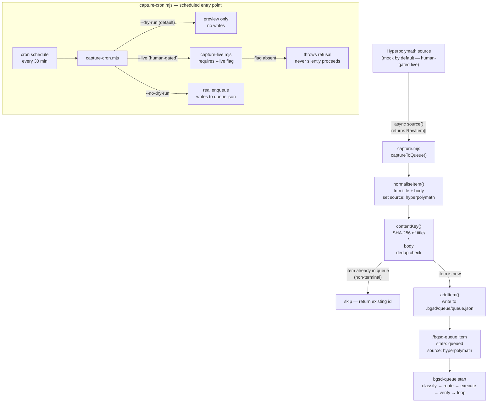

# Hyperpolymath capture→queue cron

bgsd ships a documented capture adapter that fetches external Hyperpolymath items and enqueues them into `/bgsd-queue`. The default path is completely safe: it runs against a deterministic mock source, never writes anything (dry-run on by default), and requires zero external credentials. The live Hyperpolymath hookup is **human-gated**: it is off by default, requires an explicit `--live` flag, and refuses to run if that flag is absent.

---

## Capture flow



---

## How capture works

### The capture seam contract

`capture.mjs` defines the seam: it consumes raw items from an injected `source()` function and emits `/bgsd-queue` records via `addItem`. Two shapes are involved.

**Raw item in (from source):**

```json
{
  "id":         "hp-source-001",
  "title":      "Fix login crash on Safari",
  "body":       "TypeError thrown at auth.js:42 on Safari 17.",
  "created_at": "2026-06-29T08:00:00.000Z"
}
```

**Queue record out (written by `addItem`):**

```json
{
  "id":          "item-ab12cd34-1751234567890",
  "title":       "Fix login crash on Safari",
  "body":        "TypeError thrown at auth.js:42 on Safari 17.",
  "source":      "hyperpolymath",
  "state":       "queued",
  "content_key": "<sha256 of title\n\nbody>",
  "created_at":  "2026-06-29T08:00:01.000Z"
}
```

`normaliseItem()` trims title and body, enforces the `source: "hyperpolymath"` tag, and rejects any raw item missing a title. The `raw_id` (`hp-source-001`) is reported in the capture result but is not stored in the queue record; the queue's own stable id is the authoritative identifier.

### Mock source

The default source is `bgsd/scripts/__fixtures__/hyperpolymath-mock.mjs`: a deterministic fixture that returns a small array of pre-defined items. It never makes network calls. All automated tests run against this source only (CAPTURE-04).

The mock is injected at the function boundary — `captureToQueue({ source: mockSource, dryRun: true })`. Swapping the source to the live adapter requires no changes to `capture.mjs` or `captureToQueue`.

### Idempotency via content-key dedup

Running the capture cron multiple times does not create duplicate queue entries. `addItem` computes `SHA-256(title + "\n\n" + body)` and returns the existing item id if a non-terminal item with that key already exists. The capture adapter previews this in dry-run mode (the `already_exists` flag in the would-enqueue output).

---

## Running the cron

`capture-cron.mjs` is the scheduled entry point. It defaults to dry-run against the mock source.

### Invocation modes

| Command | Source | Writes? |
|---|---|---|
| `node bgsd/scripts/capture-cron.mjs` | Mock (fixture) | No (dry-run) |
| `node bgsd/scripts/capture-cron.mjs --no-dry-run` | Mock (fixture) | Yes |
| `node bgsd/scripts/capture-cron.mjs --live` | Live Hyperpolymath | No (dry-run) |
| `node bgsd/scripts/capture-cron.mjs --live --no-dry-run` | Live Hyperpolymath | Yes |

### Dry-run output

```
bgsd capture-cron: starting capture pass
  source:  mock (fixture)
  dry-run: true
  time:    2026-06-29T08:00:00.000Z

bgsd capture result
  mode        dry-run (no changes written)
  fetched     3 item(s) from source
  would-enqueue  3 item(s)
    - [hp-001] "Fix login crash on Safari"
    - [hp-002] "Add dark mode toggle"  [already in queue — would dedup]
    - [hp-003] "Fix nav collapse below 768 px"

bgsd capture-cron: dry-run complete — no items written.
  To enqueue for real: node bgsd/scripts/capture-cron.mjs --no-dry-run
```

### Scheduling (human step)

**Do not add `--live` or `--no-dry-run` to any automated CI pipeline without first validating the output with a supervised dry-run.** Scheduling the dry-run mock path is completely safe and useful for testing the scheduling mechanism.

**macOS crontab (every 30 minutes, dry-run against mock):**

```cron
*/30 * * * * /usr/local/bin/node /absolute/path/to/better-gsd/bgsd/scripts/capture-cron.mjs >> /tmp/bgsd-capture.log 2>&1
```

Install: run `crontab -e` and paste the line above (adjust the absolute path to match your repo location).

**macOS launchd (recommended — more reliable than crontab on macOS):**

Create `~/Library/LaunchAgents/com.bgsd.capture-cron.plist`:

```xml
<?xml version="1.0" encoding="UTF-8"?>
<!DOCTYPE plist PUBLIC "-//Apple//DTD PLIST 1.0//EN" "http://www.apple.com/DTDs/PropertyList-1.0.dtd">
<plist version="1.0">
<dict>
  <key>Label</key>
  <string>com.bgsd.capture-cron</string>
  <key>ProgramArguments</key>
  <array>
    <string>/usr/local/bin/node</string>
    <string>/absolute/path/to/better-gsd/bgsd/scripts/capture-cron.mjs</string>
  </array>
  <key>StartInterval</key>
  <integer>1800</integer>
  <key>StandardOutPath</key>
  <string>/tmp/bgsd-capture.log</string>
  <key>StandardErrorPath</key>
  <string>/tmp/bgsd-capture-err.log</string>
  <key>RunAtLoad</key>
  <true/>
</dict>
</plist>
```

Load it:

```bash
launchctl load ~/Library/LaunchAgents/com.bgsd.capture-cron.plist
```

Unload it:

```bash
launchctl unload ~/Library/LaunchAgents/com.bgsd.capture-cron.plist
```

---

## Human-gated live hookup

> **Safety.** The live path hits a real external system, enqueues real items, and writes to `.bgsd/queue/queue.json`. It can only be triggered by an explicit `--live` flag. The guard (`requireLiveFlag()` in `capture-live.mjs`) checks `process.argv` — not environment variables, which CI can accidentally inject — and throws a detailed human-readable refusal if the flag is absent.

**What `--live` requires before it can succeed:**

1. **Configure the source.** Set one environment variable (never commit credentials to the repo):

   ```bash
   # Option A: local file export
   export HYPERPOLYMATH_SOURCE_PATH=~/hyperpolymath/captures/latest.json

   # Option B: API endpoint
   export HYPERPOLYMATH_API_ENDPOINT=https://api.hyperpolymath.example/captures
   export HYPERPOLYMATH_API_KEY=<your-api-key>
   ```

2. **Implement the fetch logic.** Open `bgsd/scripts/capture-live.mjs` and replace the stub inside `liveCaptureSource()` with the real fetch. The function must return `RawItem[]` matching the capture seam contract above.

3. **Validate with dry-run first.** Always confirm items look correct before writing:

   ```bash
   node bgsd/scripts/capture-cron.mjs --live
   ```

4. **Enqueue for real.** Only after the dry-run output looks correct:

   ```bash
   node bgsd/scripts/capture-cron.mjs --live --no-dry-run
   ```

5. **Add to scheduler (optional).** Only after validating steps 3 and 4 with a human watching. Even then, keep supervising the first few live runs before leaving it unattended.

**Refusal behavior.** Without `--live`, `capture-live.mjs` throws immediately with a message that names the missing configuration, lists the safe mock alternatives, and explicitly tells the operator not to add `--live` to CI. The process exits non-zero; no items are fetched or enqueued.

---

## Files

| Path | Purpose |
|---|---|
| `bgsd/scripts/capture.mjs` | Core adapter: `captureToQueue({ source, dryRun })` |
| `bgsd/scripts/capture-cron.mjs` | Cron entry point (defaults: mock + dry-run) |
| `bgsd/scripts/capture-live.mjs` | Guarded live source seam (refuses without `--live`) |
| `bgsd/scripts/__fixtures__/hyperpolymath-mock.mjs` | Deterministic mock source for tests |
| `bgsd/scripts/test-capture.mjs` | Unit tests (mock only; live source never hit in CI) |
| `bgsd/commands/bgsd-capture.md` | Slash command definition and full launchd walkthrough |
| `.bgsd/queue/queue.json` | Runtime queue store (gitignored) |

---

## Adding this page to the docs site

This page (`bgsd/docs/hyperpolymath-capture.mdx`) is valid standalone Mintlify MDX, intentionally kept outside GSD's vendored nav config (`mint.json` / `docs.json`). When a maintainer is ready to surface it, add a group entry to the Mintlify nav config:

```json
{
  "group": "bgsd",
  "pages": ["bgsd/docs/quickstart", "bgsd/docs/bgsd-verify", "bgsd/docs/bgsd-queue", "bgsd/docs/hyperpolymath-capture"]
}
```
