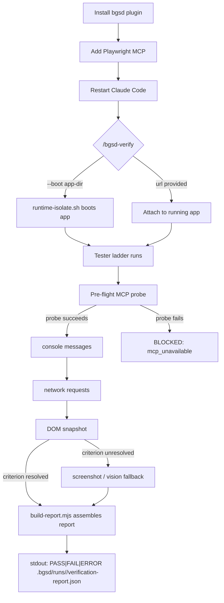

# bgsd Quickstart

bgsd is an additive Claude Code plugin that layers autonomous, self-verifying testing on top of GSD. v0 ships the **Standalone Tester**: given a running app and acceptance criteria, `/bgsd-verify` returns a structured defect list — including console-level errors that a screenshot alone would miss.

---

## End-to-end flow



---

## Step 1: Install the bgsd plugin

Run these commands from the repo root (where `bgsd/` lives):

```bash
claude plugin marketplace add ./bgsd     # register the local Directory-source marketplace
claude plugin install bgsd@bgsd-local    # install the bgsd plugin (user scope)
```

Restart Claude Code. The `/bgsd-verify` command binds at startup and appears after restart.

> **Why this works without editing GSD:** bgsd registers a *Directory* marketplace source that reads the live `bgsd/` directory. GSD's own `.claude-plugin/plugin.json` is never touched. See `bgsd/docs/INTEGRATION-NOTES.md` for the full decision record.

---

## Step 2: Add Playwright MCP

`/bgsd-verify` drives a real browser via `@playwright/mcp`. Add it once per machine:

```bash
claude mcp add playwright -- npx @playwright/mcp@0.0.76
```

Restart Claude Code again so the MCP server loads. The tester runs a mandatory pre-flight `browser_snapshot` probe on every invocation; if the MCP is missing, it emits `BLOCKED: mcp_unavailable` rather than a fabricated result.

> **Pinned version:** `@playwright/mcp@0.0.76`. Do not substitute a newer version without re-running the canary proof below.

---

## Step 3: First run — the canary fixture

bgsd ships a minimal Next.js fixture at `bgsd/fixtures/canary-next/` with two routes that prove the core value:

| Route | State | Expected verdict |
|-------|-------|-----------------|
| `/` | Clean markup, no console errors | `PASS` |
| `/buggy` | `<div>` nested inside `<p>` | `FAIL` (console `validateDOMNesting`) |

The `/buggy` route looks **identical** to a working page in a screenshot. The defect only exists in the browser console. That is exactly what bgsd catches.

**Boot the fixture and verify the clean route:**

```bash
/bgsd-verify --boot bgsd/fixtures/canary-next \
             --criteria bgsd/fixtures/canary-next/acceptance.md
```

Expected stdout (single line):

```
PASS  .bgsd/runs/20240101T120000Z/verification-report.json
```

**Then verify the buggy route (supply the URL once the fixture is running):**

```bash
/bgsd-verify http://localhost:<port>/buggy \
             --criteria bgsd/fixtures/canary-next/acceptance.md
```

Expected stdout:

```
FAIL  .bgsd/runs/20240101T120001Z/verification-report.json
```

> **Development mode required for the canary:** React's `validateDOMNesting` warning is stripped from production builds. Run the fixture in `development` mode (`NODE_ENV=development`). The report's `environment.build_mode` field and `console_reliable` flag reflect this — see [Driver-ladder behavior](/bgsd-verify#driver-ladder-behavior) in the reference page.

---

## Where the report lands

Every run writes artifacts under `.bgsd/runs/<run-id>/`:

```
.bgsd/runs/20240101T120000Z/
  verification-report.json   # full structured report (schema-validated)
  capture.json               # raw MCP output (not loaded back into context)
  findings.json              # classified failing slice
  dom-snapshot.txt           # accessibility tree from browser_snapshot
  screenshot.png             # sparse: initial load and defect evidence only
```

The `verification-report.json` is the machine-readable contract. See the [/bgsd-verify reference](./bgsd-verify.mdx) for its full schema.

---

## Next steps

- Read the [/bgsd-verify reference](./bgsd-verify.mdx) for the full arguments table, criteria input formats, report schema, and driver-ladder details.
- Run against your own app: `/bgsd-verify http://localhost:3000 --criteria path/to/UI-SPEC.md`
- Use `--inline` for ad-hoc criteria: `/bgsd-verify http://localhost:3000 --inline "Page loads without console errors; Nav renders correctly"`

---

## Adding these pages to the docs site

These pages (`bgsd/docs/quickstart.mdx` and `bgsd/docs/bgsd-verify.mdx`) are valid standalone Mintlify MDX. They are intentionally kept outside GSD's vendored nav config (`mint.json` / `docs.json`) — editing that file would violate the "never edit vendored GSD" rule. When a maintainer is ready to surface bgsd in the docs site nav, add a single group entry to the Mintlify nav config pointing at these two pages:

```json
{
  "group": "bgsd",
  "pages": ["bgsd/docs/quickstart", "bgsd/docs/bgsd-verify"]
}
```

That one addition is the only change needed; the pages render standalone without it.
