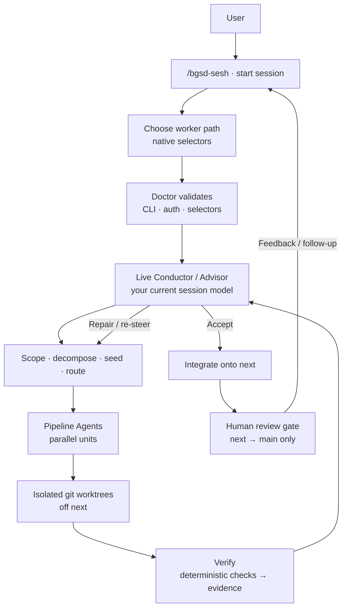

import { Card, CardGrid, LinkCard } from '@astrojs/starlight/components';

BGSD is a **verified, worktree-based GSD conductor**. You start one session with the model you want to reason with — that live session is the **Conductor and Advisor**. Every new session asks which worker path to use, Doctor validates it, Pipeline Agents build in isolated worktrees, and the Conductor adjudicates evidence before anything lands on `next`. **BGSD never writes directly to your production branch.**

## Start a session

```
/bgsd-sesh "Add export filters to the settings page"
```

| Surface | Host |
| --- | --- |
| `/bgsd-sesh`, `/bgsd-queue`, `/bgsd-recall`, `/bgsd-modify-memory`, … | Claude Code slash commands |
| `bgsd:bgsd-sesh` (and other plugin skills) | Codex |
| `node bgsd/scripts/conductor.mjs "…"` | Any harness / terminal |

Full list of every command (memory, queue, pause, remote, …) → [Commands](/commands/).

## What makes BGSD different

| Principle | What it means |
| --- | --- |
| **Harness-agnostic** | Conductor is markdown + Node — Claude Code, Cursor, or Codex. |
| **Verified, not vibes** | Deterministic checks first; Conductor adjudicates evidence. |
| **Main stays protected** | Work lands on `next`. `next` → `main` is **human-only**. |
| **Your session model stays** | BGSD never replaces the Conductor. Workers are chosen per sesh. |

## Architecture

A `/bgsd-sesh` run — steps, not model names:



| Step | Who | What happens |
| --- | --- | --- |
| Start | You | Slash command, host skill, or `conductor.mjs` |
| Choose path | You + Conductor | Native selectors pick this session's worker path |
| Doctor | Engine | Fails closed if setup is incomplete |
| Conduct | Live session | Scopes, plans, seeds — never swapped by BGSD |
| Build | Pipeline Agents | One isolated worktree per unit, branched from `next` |
| Verify | Fresh agents | Deterministic checks first; semantic evidence when needed |
| Adjudicate | Conductor | Accept, repair, escalate, or block |
| Integrate | Engine | Merge verified units onto `next` |
| Human gate | You | Only you merge `next` → `main` |
| Follow-up | You | Feedback or another sesh re-enters the loop |

Worker/model presets are documented under [Models & routing](/models/) — not frozen into this diagram.

## Workflow depth

| Mode | Best for | Build path | Evidence |
| --- | --- | --- | --- |
| **Quick** | one contained fix | direct workers; no GSD | deterministic + Conductor review |
| **Feature** | scoped product change | a few worktrees | Loop 1 + integration when needed |
| **Project** | multi-surface work | discuss, DAG, waves | Loop 1, Loop 2, fresh review, human gate |

## Next steps

<CardGrid>
  <LinkCard title="Install" href="/install/" description="Claude Code, Cursor, and Codex setup." />
  <LinkCard title="Quickstart" href="/quickstart/" description="First session in minutes." />
  <LinkCard title="Mental model" href="/mental-model/" description="Roles, worktrees, verification." />
  <LinkCard title="Models" href="/models/" description="Every-session path selectors." />
</CardGrid>
