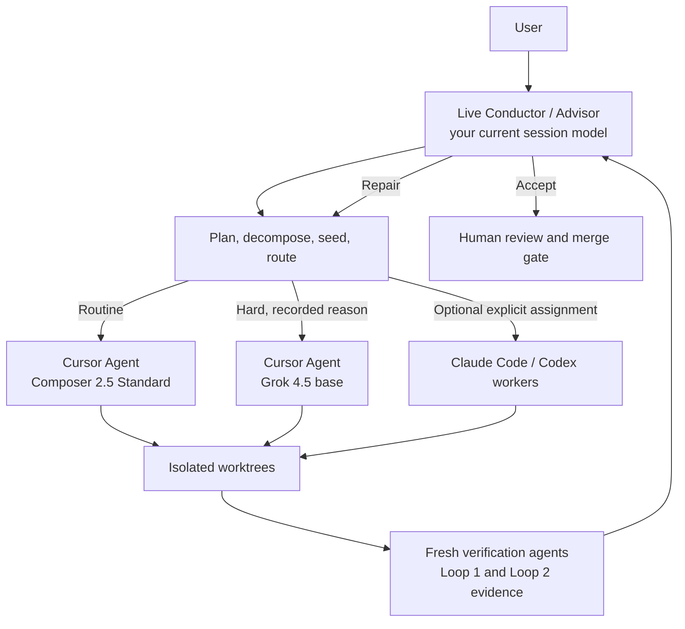

import { Card, CardGrid, LinkCard } from '@astrojs/starlight/components';

BGSD is a **verified, worktree-based GSD conductor**. You start one session with the model you want to reason with — that live session is the **Conductor and Advisor**. Pipeline Agents execute in isolated git worktrees, gather real verification evidence, and merge onto a safe integration branch. **BGSD never writes directly to your production branch.**

## Start with a slash command

After install, the same `/bgsd-*` commands work in **Claude Code**, **Cursor**, and **Codex** — each harness reads the command markdown (and skills) from the plugin / repo.

```
/bgsd-sesh "Add export filters to the settings page"
```

| Command | What it does |
| --- | --- |
| `/bgsd-sesh` | Start a verified session (the main entrypoint) |
| `/bgsd-doctor` | Preflight CLI, auth, and model selectors |
| `/bgsd-status` | Live worker / phase snapshot |
| `/bgsd-queue` | Fix-stream backlog |
| `/bgsd-pause` / `/bgsd-resume` | Park and continue a session |

Full list → [Commands](/commands/).

## What makes BGSD different

| Principle | What it means |
| --- | --- |
| **Harness-agnostic** | Run from **Claude Code**, **Cursor**, or **Codex**. The Conductor is markdown + Node — slash commands and `conductor.mjs` both work. |
| **Verified, not vibes** | Deterministic checks first. Fresh verifier agents gather semantic evidence when needed. The Conductor adjudicates — PASS/FAIL is never silent. |
| **Main stays protected** | Work lands on `next` and ephemeral worktrees. `next` → `main` is **human-only**. |
| **Your session model stays** | BGSD never replaces the Conductor model. Fast variants and Auto are never silently selected. |

## Architecture



## Workflow depth

| Mode | Best for | Build path | Evidence |
| --- | --- | --- | --- |
| **Quick** | one contained fix | direct workers; no GSD | deterministic + Conductor review |
| **Feature** | scoped product change | a few worktrees | Loop 1 + integration when needed |
| **Project** | multi-surface work | discuss, DAG, waves | Loop 1, Loop 2, fresh review, human gate |

## Next steps

<CardGrid>
  <LinkCard title="Install" href="/install/" description="Plugin + slash commands for Claude Code, Cursor, and Codex." />
  <LinkCard title="Quickstart" href="/quickstart/" description="First /bgsd-sesh in minutes." />
  <LinkCard title="Commands" href="/commands/" description="Every /bgsd-* surface." />
  <LinkCard title="Models" href="/models/" description="Every-session path selectors." />
</CardGrid>
