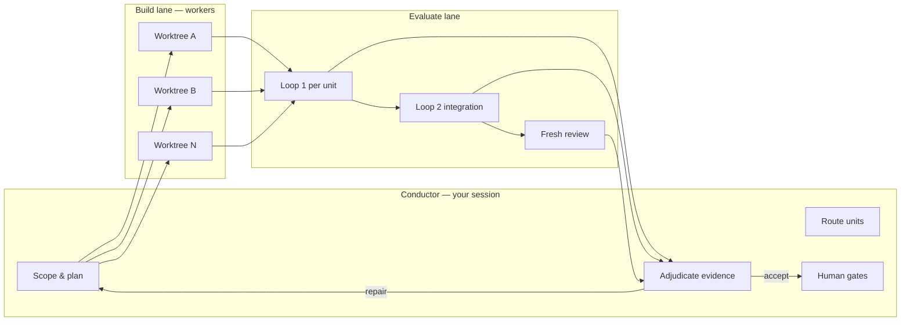

BGSD combines a live **Conductor** with independent **build** and **evaluation** lanes. Understanding these roles is the key to using it well.

## Roles

| Role | Owns | Never does |
| --- | --- | --- |
| **Conductor** | Scope, decomposition, seeds, routing reasons, evidence adjudication, human gates | Direct code edits during a session |
| **Build lane** | Pipeline Agent, GSD phases, commits in worktrees, repairs | Product-level routing without Conductor steering |
| **Evaluate lane** | Loop 1 verifier, Loop 2 integration verifier, fresh review | Silent PASS → ship decisions |
| **Human** | `next` → `main` merge, contestable gates | — |

The Conductor is whichever session you started — Claude, Cursor, or Codex. BGSD records its provider and model but **does not replace it**.

## Session anatomy



## Worktrees and branches

Every unit gets an isolated git worktree branched from the standing **integration branch** (`next` by default):

```
main          ← human-only, never written by BGSD
  └── next    ← integration mirror; all merges land here
        ├── bgsd-<run>/unit-auth-c3d4
        ├── bgsd-<run>/unit-export-a1b2
        └── …
```

BGSD syncs `next` from `main` at session start (configurable) so integration never falls behind production.

## Verification philosophy

Verification is **deterministic-first**:

1. Tests, typecheck, lint, build, Playwright (when UI testing is enabled)
2. Fresh verifier agent for semantic inspection **only when needed**
3. Conductor adjudicates — evidence informs, never auto-merges to `main`

"No silent green" is a core invariant. A verifier PASS is input to the Conductor, not a product decision.

## Workflow modes

| Mode | GSD depth | Worker model |
| --- | --- | --- |
| Quick | None — direct workers | Adaptive count; serial or parallel |
| Feature | Partial — a few units | Per-unit GSD batch |
| Project | Full — discuss, DAG, waves | Full GSD units with Loop 1 + 2 |

Mode affects **workflow depth**, not the Conductor's model. Complexity does not secretly swap models.

## Artifacts and memory

| Location | Contents |
| --- | --- |
| `.bgsd/ledger.md` | Index of every session |
| `.bgsd/seshs/<run-id>/` | Per-session record (RUN.md, AGENTS.md, planning) |
| `.bgsd/queue/` | Canonical backlog (not a markdown file) |
| `BGSD.md` | Per-repo settings the Conductor reads every session |

Search history: `node bgsd/scripts/kb.mjs --query "<terms>"`

## The Kiwi conductor

By default the Conductor presents as **Kiwi** (🥝) — configurable in `BGSD.md` under `conductor.name` and `conductor.emoji`. It narrates stage-aware updates and suggests exact commands at human gates.

## Related

- [Branch & safety](/branch-safety/) — `main` protection in detail
- [Conductor session](/conductor-session/) — cadence and steering
- [Harnesses](/harnesses/) — where you launch from
