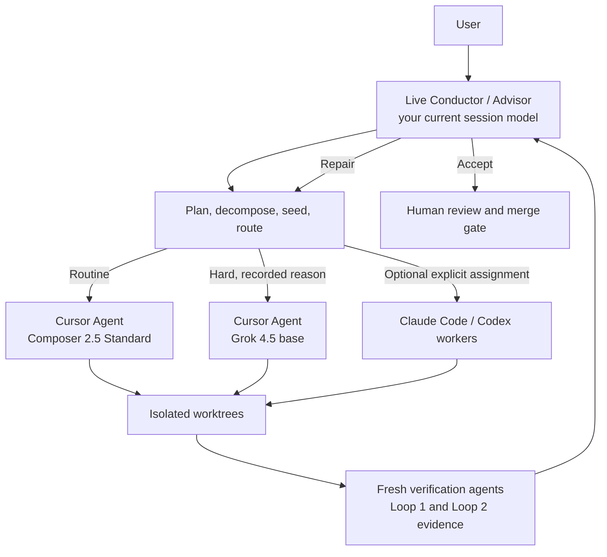

import { Card, CardGrid, LinkCard } from '@astrojs/starlight/components';

BGSD is a **verified, worktree-based GSD conductor**. You start one session with the model you want to reason with — that live session is the **Conductor and Advisor**. Pipeline Agents execute in isolated git worktrees, gather real verification evidence, and merge onto a safe integration branch. **BGSD never writes directly to your production branch.**

## What makes BGSD different

| Principle | What it means |
| --- | --- |
| **Harness-agnostic** | Run from **Claude Code**, **Cursor**, or **Codex**. The Conductor reads markdown instructions and node scripts — it does not care which IDE spawned it. |
| **Verified, not vibes** | Deterministic checks first (tests, typecheck, lint, build). Fresh verifier agents gather semantic evidence when needed. The Conductor adjudicates — PASS/FAIL is never a silent product decision. |
| **Main stays protected** | All work lands on `next` and ephemeral worktree branches. The merge from `next` → `main` is **human-only**. |
| **Your session model stays** | BGSD records the Conductor's provider and model but never replaces it. Fast variants and Auto are never silently selected. |

## Architecture at a glance

## Workflow depth

| Mode | Best for | Build path | Evidence |
| --- | --- | --- | --- |
| **Quick** | one contained fix | Conductor-planned direct workers; no GSD | deterministic checks + Conductor review |
| **Feature** | a scoped product change | a few worktrees; Loop 2 when needed | per-unit plus integration when applicable |
| **Project** | multi-surface work | discuss, DAG, waves, full GSD units | Loop 1, Loop 2, fresh review, human gate |

## Next steps

<CardGrid>
  <LinkCard title="Install" href="/install/" description="Add BGSD to your harness." />
  <LinkCard title="Quickstart" href="/quickstart/" description="Start your first verified session." />
  <LinkCard title="Mental model" href="/mental-model/" description="Roles, lanes, and branch safety." />
  <LinkCard title="Harnesses" href="/harnesses/" description="Claude Code, Cursor, and Codex." />
</CardGrid>
